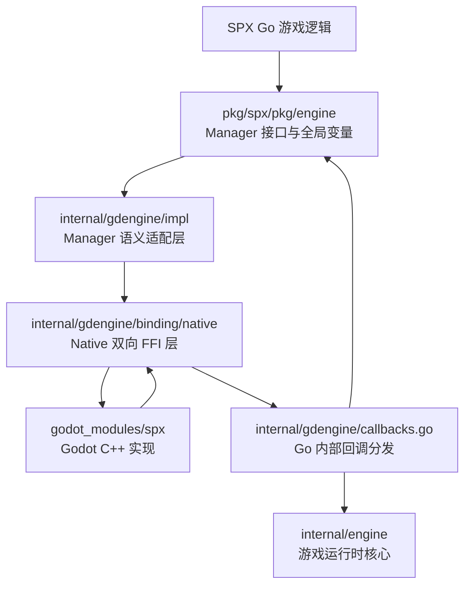
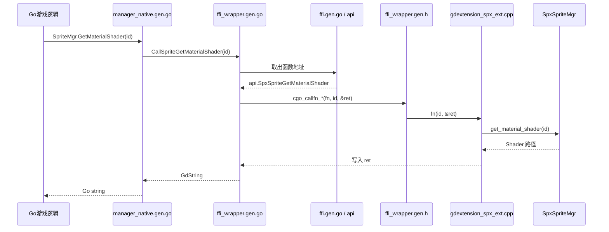
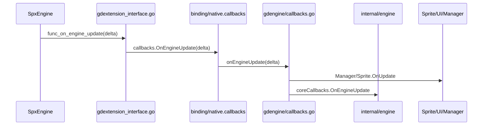

# SPX 与 Godot 的 Native 双向绑定

本文梳理 Native 平台下 SPX Go 代码与 Godot C++ 模块之间的双向调用关系，重点说明 `internal/gdengine/impl`、`internal/gdengine/binding/native`、ABI 头文件和回调分发层各自承担的职责。

## 1. 整体结构

Native 侧存在两条方向相反的调用链：

```text
Go 主动调用 Godot：impl -> binding/native -> Godot C++
Godot 主动回调 Go：Godot C++ -> binding/native -> callbacks.go -> 上层运行时或对象
```



| 目录或文件 | 核心职责 |
|---|---|
| `pkg/spx/pkg/engine` | 定义 `ISpriteMgr`、`IAudioMgr` 等接口，以及全局 Manager 变量 |
| `internal/gdengine/impl` | 实现 Manager 接口，完成主线程调度和 Go/ABI 类型转换 |
| `internal/gdengine/binding/native` | 查找、保存、调用 C++ 函数指针，同时提供 C++ 回调 Go 的入口 |
| `internal/gdengine/callbacks.go` | 将底层回调分发给 Manager、Sprite、UI 或上层运行时 |
| `godot_modules/spx` | 实际操作 Godot 节点、资源、音频、精灵和画笔 |

简单来说：

```text
impl
= Manager 语义适配层
= 主要解决 Go 如何方便地调用 Godot Manager

binding/native
= Native ABI 通信层
= 同时解决 Go 调用 C++ 和 C++ 回调 Go
```

## 2. Native 使用的接口规范

Native 绑定建立在两层 ABI 规范上：

```text
Godot 官方 ABI
gdextension_interface.h
        |
        v
SPX 自定义 ABI
gdextension_spx_ext.h
```

| 文件 | 是否由当前 SPX codegen 生成 | 职责 |
|---|---:|---|
| [`gdextension_interface.h`](../../../../internal/gdengine/binding/native/gdextension_interface.h) | 否 | Godot 官方 GDExtension 类型、初始化结构和接口函数规范 |
| [`gdextension_spx_ext.h`](../../../../internal/gdengine/binding/native/gdextension_spx_ext.h) | 是 | SPX Manager 接口、回调接口和公共 ABI 类型 |
| [`gdextension_spx_interface.h`](../../../../internal/gdengine/binding/native/gdextension_spx_interface.h) | 否 | 聚合 Godot ABI、SPX ABI 和回调包装头文件 |
| [`gdextension_interface.go`](../../../../internal/gdengine/binding/native/gdextension_interface.go) | 否 | Go/cgo 手写适配层：类型转换、内存管理、初始化和回调入口 |

`gdextension_spx_ext.h` 在以下两个位置各保存一份相同内容：

- `internal/gdengine/binding/native/gdextension_spx_ext.h`：供 Go/cgo Native 绑定编译使用。
- `godot_modules/spx/gdextension_spx_ext.h`：供 Godot C++ 模块编译使用。

代码生成器会把同一个 `headers.Standard` 同时写入两处，从而保证双方使用完全一致的函数签名和数据布局。

### 2.1 三类 ABI 声明

```text
GdObj / GdString / GdArray
    双方共享的数据表示

GDExtensionSpxAudio* / Sprite* / Pen*
    Go -> Godot 的函数指针签名

GDExtensionSpxCallback*
    Godot -> Go 的回调函数签名
```

例如，下面的类型规定 Go 应当如何调用“获取材质 Shader”对应的 C++ 函数：

```cpp
typedef void (*GDExtensionSpxSpriteGetMaterialShader)(
    GdObj obj,
    GdString *ret_value
);
```

C++ 侧不一定直接使用 `GDExtensionSpxSpriteGetMaterialShader` 这个类型名，但它提供的真实函数必须具有相同签名，否则调用时参数和返回值将发生错位。

## 3. Go 主动调用 Godot Manager

### 3.1 相关生成文件

| 文件 | 职责 |
|---|---|
| [`manager_native.gen.go`](../../../../internal/gdengine/impl/manager_native.gen.go) | 实现 Go Manager 接口，负责主线程调度和上层类型转换 |
| [`ffi.gen.go`](../../../../internal/gdengine/binding/native/ffi.gen.go) | 按名称查找并保存 C++ 函数地址 |
| [`ffi_wrapper.gen.go`](../../../../internal/gdengine/binding/native/ffi_wrapper.gen.go) | 从 `api` 取出函数地址，准备 C 参数和返回值 |
| [`ffi_wrapper.gen.h`](../../../../internal/gdengine/binding/native/ffi_wrapper.gen.h) | 真正执行 C 函数指针 `fn(...)` |
| [`gdextension_spx_ext.cpp`](../../../../godot_modules/spx/gdextension_spx_ext.cpp) | 提供并注册 C++ 转发函数，最终调用实际 `Spx*Mgr` |

因此，更完整的一组 Native Manager 绑定代码是：

```text
manager_native.gen.go
        |
        v
ffi_wrapper.gen.go
        |
        v
ffi_wrapper.gen.h
        |
        v
ffi.gen.go 中 api 保存的函数地址
        |
        v
godot_modules/spx/gdextension_spx_ext.cpp
        |
        v
Godot Spx*Mgr
```

### 3.2 `api` 的含义

`api GDExtensionInterface` 不是一个主动执行方法的对象，而是一张保存 C++ 函数地址的表：

```text
api
├── SpxAudioStopAll             -> 某个 C++ 函数地址
├── SpxSpriteGetMaterialShader  -> 某个 C++ 函数地址
├── SpxPenCreatePen             -> 某个 C++ 函数地址
└── ...
```

初始化时，`ffi.gen.go` 按名称查找函数地址：

```go
x.SpxSpriteGetMaterialShader =
    GDExtensionSpxSpriteGetMaterialShader(
        resolveCFunc("spx_sprite_get_material_shader"),
    )
```

Godot C++ 则提前注册名称与地址之间的关系：

```cpp
REGISTER_SPX_INTERFACE_FUNC(spx_sprite_get_material_shader);
```

宏展开后的含义大致为：

```cpp
GDExtension::register_interface_function(
    "spx_sprite_get_material_shader",
    &gdextension_spx_sprite_get_material_shader
);
```

### 3.3 `GetMaterialShader` 调用示例



`ffi_wrapper.gen.go` 中：

```go
arg0 := C.GDExtensionSpxSpriteGetMaterialShader(
    api.SpxSpriteGetMaterialShader,
)
arg1 := C.GdObj(obj)
var retVal C.GdString

C.cgo_callfn_GDExtensionSpxSpriteGetMaterialShader(
    arg0,
    arg1,
    &retVal,
)
```

其中：

```text
api.SpxSpriteGetMaterialShader = C++ 函数地址
arg0                           = 从 api 取出的函数地址
arg1                           = 转换后的对象 ID
&retVal                        = C++ 写入返回值的位置
```

Go 不能直接调用 C 函数指针，因此进入 `ffi_wrapper.gen.h` 中的 C 包装器：

```cpp
void cgo_callfn_GDExtensionSpxSpriteGetMaterialShader(
    GDExtensionSpxSpriteGetMaterialShader fn,
    GdObj obj,
    GdString *ret_val
) {
    if (!fn) {
        return;
    }
    fn(obj, ret_val);
}
```

真正跳入 Godot C++ 的是：

```cpp
fn(obj, ret_val);
```

C++ 转发函数再调用实际 Manager：

```cpp
static void gdextension_spx_sprite_get_material_shader(
    GdObj obj,
    GdString *ret_val
) {
    *ret_val = spriteMgr->get_material_shader(obj);
}
```

最后，`manager_native.gen.go` 使用 `ToString()` 将返回的 ABI 字符串复制成 Go `string`，并释放 C++ 返回的字符串内存。

## 4. Godot 回调 Go

Godot 回调 Go 使用 `GDExtensionSpxCallback*` 函数指针类型和 `SpxCallbackInfo` 回调表。

### 4.1 完整回调链



`gdextension_interface.go` 中的 Go 函数通过 cgo 导出为 C 可调用函数：

```go
//export func_on_engine_update
func func_on_engine_update(delta C.GDReal) {
    if callbacks.OnEngineUpdate != nil {
        callbacks.OnEngineUpdate(float64(delta))
    }
}
```

`gdextension_spx_wrap.h` 将这些函数填入回调表：

```cpp
SpxCallbackInfo info = {0};
info.func_on_engine_start = func_on_engine_start;
info.func_on_engine_update = func_on_engine_update;
info.func_on_engine_destroy = func_on_engine_destroy;
```

Godot 的 `SpxEngine` 保存回调表，并在相应时机调用：

```cpp
if (callbacks.func_on_engine_update) {
    callbacks.func_on_engine_update(delta);
}
```

### 4.2 Go 内部如何接线

[`internal/gdengine/callbacks.go`](../../../../internal/gdengine/callbacks.go) 中的 `bindCallbacks()` 创建完整的 `CallbackInfo`：

```go
func bindCallbacks() CallbackInfo {
    return CallbackInfo{
        CoreCallbackInfo: CoreCallbackInfo{
            OnEngineStart:  onEngineStart,
            OnEngineUpdate: onEngineUpdate,
        },
        OnSpriteReady: onSpriteReady,
        OnUiPressed:   onUiPressed,
    }
}
```

随后：

```text
bindCallbacks()
    |
    v
facade.RegisterCallbacks(...)
    |
    v
binding/native.BindCallback(...)
    |
    v
binding/native.callbacks 保存完整回调表
```

这里存在两张容易混淆的回调表：

| 回调表 | 含义 |
|---|---|
| `binding/native.callbacks` | 跨语言入口使用的完整 `CallbackInfo`，接住 Godot 的全部回调 |
| `gdengine.coreCallbacks` | `internal/engine` 传入的核心运行时回调，只处理游戏全局生命周期和原始输入 |

## 5. `callbacks.go` 的事件分类

`callbacks.go` 是回调进入 Go 后的统一分流点。

### 5.1 内部处理后继续转发

| 回调 | `gdengine` 内部处理 | 是否继续调用 `coreCallbacks` |
|---|---|---:|
| `OnEngineStart` | 调用所有 `Manager.OnStart()` | 是 |
| `OnEngineUpdate` | 更新时间、Manager 和 Sprite | 是 |
| `OnEngineFixedUpdate` | 调用 Manager 和 Sprite 的固定帧更新 | 是，但上层当前通常未赋值 |
| `OnEngineDestroy` | 销毁 Sprite 和 Manager | 是 |
| `OnEnginePause` | 通知所有 Manager | 是 |

以每帧更新为例：

```text
Godot OnEngineUpdate
        |
        v
gdengine.onEngineUpdate
├── 修正逻辑 delta
├── Manager.OnUpdate
├── 更新时间
├── Sprite.OnUpdate
├── coreCallbacks.OnEngineUpdate
└── InternalUpdateEngine
```

### 5.2 主要转发给上层运行时

| 回调 | 目标 |
|---|---|
| `OnEngineDestroyed` | `coreCallbacks.OnEngineDestroyed` |
| `OnEngineReset` | `coreCallbacks.OnEngineReset` |
| `OnMousePressed/Released` | `coreCallbacks` 中对应输入回调 |
| `OnKeyPressed/Released` | `coreCallbacks` 中对应输入回调 |

这些事件会影响整个游戏运行状态、输入状态或生命周期，因此需要交给 `internal/engine` 继续处理。

### 5.3 由 `gdengine` 内部直接消费

| 分类 | Godot 回调 | 内部处理 | 可以内部消费的原因 |
|---|---|---|---|
| 场景精灵绑定 | `OnSceneSpriteInstantiated` | `BindSceneInstantiatedSprite` | 只负责建立 Godot 节点与 Go 精灵的映射 |
| 精灵生命周期 | `OnSpriteReady` | 查找精灵并调用 `OnStart()` | `gdengine` 已持有 `ID -> ISpriter` 注册表 |
| 精灵生命周期 | `OnSpriteDestroyed` | `DeleteSprite` | 属于同一套对象注册关系的清理 |
| 精灵可见性 | `ScreenEntered/Exited` | 调用目标精灵事件 | 事件只属于指定精灵 |
| 精灵动画 | `AnimationFinished/Looped/Changed`、`FrameChanged` 等 | 调用对应精灵事件 | 已携带精灵 ID，可以直接定位目标 |
| 精灵特效 | `OnSpriteVfxFinished` | 调用精灵 VFX 完成事件 | 属于单个精灵状态 |
| 触发器 | `OnTriggerEnter/Exit` | 找到双方精灵并调用对象事件 | `gdengine` 可以将两个 ID 还原为对象 |
| UI 交互 | 点击、悬停、切换、文本变化等 | 查找 `UiNode` 并调用节点事件 | 属于明确的 UI 节点 |
| UI 生命周期 | `OnUiDestroyed` | `DeleteUINode` | 属于 UI 注册表清理 |

分类依据是事件的所有权：

```text
带有明确对象 ID
-> gdengine 已经可以找到 Sprite 或 UiNode
-> 直接投递给对象

Manager/Sprite 生命周期
-> 对象由 gdengine 创建和持有
-> gdengine 负责保证启动、更新和销毁顺序

全局游戏流程
-> 涉及脚本调度、协程、输入缓存和 Game 生命周期
-> 继续转发给 coreCallbacks
```

### 5.4 当前仅占位或记录日志

| 回调 | 当前状态 |
|---|---|
| `OnSpriteUpdated/FixedUpdated` | 只记录日志 |
| `OnActionPressed/JustPressed/JustReleased` | 只记录日志 |
| `OnAxisChanged` | 只记录日志 |
| `OnCollisionEnter/Stay/Exit` | 只记录日志 |
| `OnTriggerStay` | 空实现 |
| `OnUiReady/Updated` | `bindCallbacks()` 当前没有绑定 |

## 6. 最终心智模型

```text
Go -> Godot

上层 Go 接口
-> impl：把业务调用转换成 ABI 调用
-> binding/native：查找并调用 C++ 函数指针
-> gdextension_spx_ext.cpp：C++ 转发
-> Spx*Mgr：执行实际 Godot 操作
```

```text
Godot -> Go

Godot 引擎事件
-> SpxCallbackInfo 中的函数指针
-> binding/native：跨过 C/Go 边界
-> callbacks.go：识别事件归属
-> 对象事件由 gdengine 内部消费
-> 全局事件继续交给 internal/engine
```

一句话概括：

> `impl` 解决“Go 侧 Manager 怎么调用”，`binding/native` 解决“Go 与 C++ 怎么跨边界双向通信”，`callbacks.go` 解决“回到 Go 后事件应该交给谁”。
