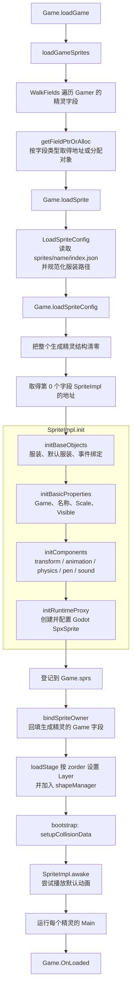

# SPX 单个精灵的初始化流程与字段来源

本文以项目中一个普通的、非克隆精灵为对象，说明它从 `assets/sprites/<name>/index.json` 进入 `Game`，直到可以运行脚本时经历了什么，以及 `SpriteImpl` 和各组件字段分别从哪里取得初始值。

文中的结论对应当前代码实现。运行时克隆走 `SpriteImpl.InitFrom` 和 `spriteComponents.cloneFrom`，热重载也有额外的校验与替换步骤，不属于本文主线。

## 1. 先区分四种初始化来源

精灵字段并不都来自 `SpriteConfig`。阅读后面的表格时，可以按下面四类理解：

| 来源 | 含义 | 例子 |
|---|---|---|
| Go 零值 | `loadSpriteConfig` 先清零整个生成精灵对象；指针、map、slice 为 `nil`，数值为 `0`，bool 为 `false` | `original == nil`、`bubble == nil` |
| `SpriteConfig` | 直接或经过类型转换读取角色 `index.json` | `transform.x = cfg.X`、`Scale = cfg.Size` |
| 运行时默认值或计算值 | 配置缺省时使用代码默认值，或者根据其他字段计算 | `mass = 1`、动画 `Duration`、画笔默认颜色 |
| 运行时对象或惰性资源 | 由 `Game` 注入，或首次使用功能时才创建 | `g`、`SyncSprite`、`penObj`、`soundObj` |

这里最容易误解的是：

```go
sc.pen = &penComponent{}
sc.pen.initialize(sprite, spriteCfg)
```

`&penComponent{}` 不是“给 `pen` 一个空指针”，而是分配一个真实的 `penComponent` 对象，此时对象内部所有字段先取 Go 零值。紧接着的 `initialize` 再写入 `sprite`、默认画笔颜色和宽度等字段。只有 `penObj` 仍然保持 `nil`，等第一次真正使用画笔时才创建底层画笔对象。

## 2. 完整流程图



有两个重要的时间边界：

1. `SpriteImpl.init` 会创建 Go 状态和 Godot 代理，但不会执行精灵的 `Main`。
2. `loadStage` 返回前只把 `awake`、`Main`、`OnLoaded` 排入 bootstrap 队列；它们之后才按图中顺序执行。

## 3. 配置进入 `SpriteImpl` 之前

`WalkFields` 遍历生成 `Game` 中的字段时，`getFieldPtrOrAlloc` 按字段类型处理：

- `*ConcreteSprite` 字段：创建新的 `ConcreteSprite`，写回字段并返回新对象。这里不检查原指针是否为 `nil`，原来已有的指针也会被替换。
- `Sprite` 接口字段：按字段名从 `g.typs` 找到具体类型，创建对象并写入接口字段。
- 普通值字段：不分配新值，只返回现有字段的地址；后续只有实现了 `Sprite` 且名称已登记的字段才会进入加载。

### 3.1 此时 `cfg` 已经有数据

调用链是：

```text
Game.loadSprite
  -> coreproject.LoadSpriteConfig
  -> Game.loadSpriteConfig(..., &loaded.Config)
```

`LoadSpriteConfig` 已经完成两件事：

- 把 `sprites/<name>/index.json` 反序列化为 `SpriteConfig`。
- 把 `costumes`、`costumeSet`、`costumeMPSet` 中的相对图片路径规范化为相对项目 `assets` 根的路径。

它还没有加载图片像素，也没有创建 Godot Resource。图片真正交给 Godot 代理是在后面的 `applyCostumeUpdate`。

### 3.2 整个生成精灵先被清零

`loadSpriteConfig` 的关键代码是：

```go
vSpr := reflect.ValueOf(sprite).Elem()
vSpr.Set(reflect.Zero(vSpr.Type()))
base := vSpr.Field(0).Addr().Interface().(*SpriteImpl)
base.init(p, name, cfg, gamer, sprite)
```

假设生成结构在概念上类似：

```go
type Jaime struct {
    SpriteImpl // 第 0 个字段
    *Game      // 由 bindSpriteOwner 在最后回填
}
```

清零后，`SpriteImpl` 不是不存在了，它仍然是 `Jaime` 结构体内部的一块内存。`Field(0).Addr()` 取得的正是这块内存的地址，因此 `base` 是有效的 `*SpriteImpl`，只是其字段暂时全为零值。这样做也保证重新加载时不会误用旧组件、旧事件 owner 或旧 Godot 代理。

## 4. `SpriteImpl.init` 的四个阶段

### 4.1 `initBaseObjects`：服装和事件入口

#### `baseObj` 字段

| 字段 | 初始化方式 | `SpriteImpl.init` 完成后的状态 |
|---|---|---|
| `costumes` | `cfg.Costumes` 逐项经 `newCostume` 转换；否则展开 `cfg.CostumeSet` 或 `cfg.CostumeMPSet` | 非空项目通常得到 `[]*costume` |
| `costumeIndex` | 读取 `cfg.CostumeIndex`；小于 0 或超出服装数量时回退为 `0` | 当前服装下标 |
| `greffUniforms` | 清零时为 `nil`；创建代理时 `applyGraphicEffects` 会通过 `requireGreffUniforms` 建立空 map | 空 `map[EffectKind]float64`，尚无图形特效值 |
| `runtimeState` | 一部分由服装初始化，一部分由基础属性和代理初始化完成 | 见下一张表 |

单张图片服装内部字段的来源如下：

| `costume` 字段 | 来源 |
|---|---|
| `name` | `CostumeConfig.Name` |
| `path` | 已规范化的 `CostumeConfig.Path` |
| `center` | `CostumeConfig.X/Y` |
| `faceRight` | `CostumeConfig.FaceRight` |
| `bitmapResolution` | 由资产 frame helper 根据配置解析 |
| `width`、`height`、`imageSize` | 由配置尺寸和资源实际尺寸经资产 frame helper 计算 |
| `setIndex` | 普通图片为 `-1`；图集帧为其 frame index |
| `posX`、`posY`、`atlasUVRect` | 由普通图片或图集 frame helper 计算 |
| `pivot` | 普通精灵服装保持零值；不要和 `SpriteConfig.Pivot` 混淆，后者写入 transform 组件 |

`BaseObjRuntimeState` 在 `SpriteImpl.init` 完成时的状态：

| 字段 | 初始化过程和最终值 |
|---|---|
| `SyncSprite` | 先为 `nil`，`initRuntimeProxy` 中变成新建的 `*engine.Sprite` |
| `Scale` | `cfg.Size` |
| `IsCostumeSet` | 使用 `costumeSet`/`costumeMPSet` 时为 `true`，普通 `costumes` 时为 `false` |
| `IsCostumeDirty` | 选择服装时先置 `true`，初始服装提交给 Godot 后被消费为 `false` |
| `Layer` | 初始零值 `0`；稍后的 `loadStage` 按 `zorder` 改成从 `firstSpriteLayer` 开始的层 |
| `IsLayerDirty` | 服装/层设置时可能置 `true`，代理提交后为 `false`；`loadStage` 改层时会再次置脏 |
| `HasShader` | 普通独立图片初始通常为 `false`；图集服装会为 UV 重映射建立材质并变为 `true`，设置图形效果时也会变为 `true` |
| `IsAnimating` | 选择初始服装时明确置 `false`；默认动画要到 `awake` 才尝试播放 |
| `hasDestroyed` | `atomic.Bool` 的零值，即未销毁 |

事件绑定不是从 JSON 读取的：

```go
p.scriptEventBindings.bind(&g.scriptEvents, p)
```

它把 `scriptEventRegistry` 指向当前 `Game` 的共享事件注册表，把 `owner` 设置为当前 `SpriteImpl`。具体的 `OnClick`、`OnKey` 等处理器要等精灵 `Main` 执行时才注册。

### 4.2 `initBasicProperties`：精灵身份和基础显示状态

#### `SpriteImpl` 自身字段

| 字段 | 来源/初值 |
|---|---|
| `baseObj` | 上一阶段完成 |
| `scriptEventBindings` | 当前 `Game` 的事件表 + 当前精灵作为 owner |
| `sprite` | 调用 `loadSpriteConfig` 时传入的业务精灵接口对象 |
| `original` | Go 零值 `nil`；只有克隆体才指向原始精灵 |
| `spriteState` | 部分读取配置，其余是生命周期零值，详见下表 |
| `proxyPublication` | `nil`；它只服务于克隆代理的延迟公开状态机 |
| `name` | Gamer 字段名/精灵配置名，例如 `Jaime` |
| `components` | 清零后各组件指针均为 `nil`，下一阶段创建 |
| `g` | 当前 `*Game` |
| `gamer` | 生成游戏结构的 `reflect.Value` |

#### `SpriteRuntimeState` 字段

| 字段 | 来源/变化 |
|---|---|
| `IsVisible` | `cfg.Visible` |
| `Cloned` | 零值 `false` |
| `IsDying` | 零值 `false` |
| `IsDirty` | 清零后为 `false`；代理创建末尾的 `markProxyDirty` 改为 `true` |
| `DirtyVersion` | 从 `0` 开始，初次 `markProxyDirty` 后通常为 `1` |
| `ProxySyncVersion` | `0`；等第一次批量同步完成后更新 |
| `VisualVersion` | 从 `0` 开始，`markProxyDirty -> markVisualDirty` 后通常为 `1` |
| `IsAwakened` | 明确设为 `false`；bootstrap 中执行 `awake` 后变为 `true` |
| `HasOnCloned` | 零值 `false`，执行 `Main` 注册相应事件后才可能改变 |
| `HasOnTouchStart` | 零值 `false`，执行 `Main` 注册触碰开始事件后可变为 `true` |
| `HasOnTouching` | 零值 `false`；当前代码除克隆状态重置外没有其他写入点 |
| `HasOnTouchEnd` | 零值 `false`；当前代码除克隆状态重置外没有其他写入点 |
| `DefaultCostumeIndex` | `baseObj` 校验后的 `costumeIndex` |

### 4.3 `initComponents`：创建五个常驻组件

组件容器初始化前后可以概括为：

```text
清零后：
transform=nil animation=nil physics=nil pen=nil sound=nil bubble=nil

initComponents 后：
transform=*transformComponent
animation=*animationComponent
physics=*physicsComponent
pen=*penComponent
sound=*soundComponent
bubble=nil
```

每个常驻组件都先通过 `&XxxComponent{}` 得到一个内部字段为零值的对象，再调用自己的 `initialize`。所有组件嵌入的 `componentBase.sprite` 都由 `componentBase.initialize` 指回当前 `SpriteImpl`。

#### Transform 组件

| 字段 | 来源/初值 |
|---|---|
| `componentBase.sprite` | 当前 `SpriteImpl` |
| `x` | `cfg.X` |
| `y` | `cfg.Y` |
| `direction` | `cfg.Heading` |
| `rotationStyle` | `cfg.RotationStyle` 经 `toRotationStyle` 转换；`left-right`/`leftRight`、`none`、`normal` 分别映射到相应枚举，空值或未知值回退 `Normal` |
| `pivot` | `cfg.Pivot` |
| `isDirty` | 明确为 `false` |

注意：缩放不在 transform 组件里，而在 `baseObj.runtimeState.Scale` 中，值来自 `cfg.Size`。

#### Animation 组件

| 字段 | 来源/初值 |
|---|---|
| `componentBase.sprite` | 当前 `SpriteImpl` |
| `shared` | 新建 `sharedAnimationData` |
| `shared.animations` | 新建空 map，然后仅遍历 `cfg.FAnimations` 填充 |
| `shared.animBindings` | 新建空 map，再复制 `cfg.AnimBindings` |
| `shared.defaultAnimation` | `cfg.DefaultAnimation` |
| `shared.animationWrappers` | 为每个已解析的 frame animation 创建 wrapper，引用精灵名、服装列表和 `IsCostumeSet` |
| `curAnimState` | 零值 `nil` |
| `curTweenState` | 零值 `nil` |
| `activeTweenStates` | 零值 `nil`；克隆初始化路径会建立空 slice，但普通初始精灵不会 |
| `defaultAnimActive` | 零值 `false` |
| `doneAnimations` | `make([]string, 0)`，是长度 0 的非 nil slice |

每个 `AniConfig` 还会补充或计算运行时字段：

| 字段 | 规则 |
|---|---|
| `FrameFps` | 配置为 `0` 时改为 `25` |
| `TurnToDuration` | 配置为 `0` 时改为 `1.0` |
| `StepDuration` | 配置为 `0` 时改为 `0.01` |
| `IFrameFrom`、`IFrameTo` | 根据 `FrameFrom`、`FrameTo` 和服装范围解析 |
| `Speed` | 初始化为 `1` |
| `Duration` | `(abs(IFrameFrom - IFrameTo) + 1) / FrameFps` |

当前这条初始化路径只读取 `FAnimations`。`SpriteConfig` 虽然还声明了 `MAnimations` 和 `TAnimations`，但 `animationComponent.initFromConfig` 当前没有消费它们。

#### Physics 组件

| 字段 | 来源/初值 |
|---|---|
| `componentBase.sprite` | 当前 `SpriteImpl` |
| `collisionInfo` | 从 `CollisionMask/Layer/ShapeType/Pivot/ShapeParams` 解析 |
| `triggerInfo` | 从 `TriggerMask/Layer/ShapeType/Pivot/ShapeParams` 解析 |
| `physicsMode` | `cfg.PhysicsMode`：空值或 `no` 为 `NoPhysics`，另支持 `kinematic`、`dynamic`、`static`；未知值告警并回退 `NoPhysics` |
| `mass` | `cfg.Mass` 指针有值时取配置，否则默认 `1` |
| `friction` | `cfg.Friction` 指针有值时取配置，否则默认 `1` |
| `airDrag` | `cfg.AirDrag` 指针有值时取配置，否则默认 `1` |
| `gravity` | `cfg.Gravity` 指针有值时取配置，否则默认 `1` |
| `autoShapesDirty` | 零值 `false`，向代理提交物理配置后也明确设为 `false` |
| `collisionTargets` | `make(map[string]bool)`，初始为空但非 nil |

`collisionInfo` 和 `triggerInfo` 都是 `physicConfig`：

| `physicConfig` 字段 | 碰撞体 | 触发器 |
|---|---|---|
| `Mask` | `cfg.CollisionMask`，缺省为 `1` | `cfg.TriggerMask`，缺省为 `1` |
| `Layer` | `cfg.CollisionLayer`，缺省为 `1` | `cfg.TriggerLayer`，缺省为 `1` |
| `Type` | 配置缺省时：项目启用 physics 则为 auto，否则为 none | 配置缺省时为 auto |
| `Pivot` | `cfg.CollisionPivot` | `cfg.TriggerPivot` |
| `Params` | `cfg.CollisionShapeParams` | `cfg.TriggerShapeParams` |
| 非法形状回退 | `Type=none`、`Params=nil` | `Type=auto`、`Params=nil` |

如果项目启用自动碰撞层，创建 Godot 代理前的 `initCollisionParams` 还会按项目的精灵碰撞关系重算 `Layer/Mask`。因此 JSON 中的初值不一定是最终提交到 Godot 的层值。

当前 `applyPhysicsProxyConfig` 会向 Godot 提交形状、层/mask、`gravity` 和 `physicsMode`。`mass`、`friction`、`airDrag` 会保存在 Go 组件字段中，但当前该函数没有把这三个字段直接下发给代理。

#### Pen 组件

Pen 初始化目前不读取 `SpriteConfig` 的业务字段；传入 `spriteCfg` 只是为了满足统一组件接口。

| 字段 | 来源/初值 |
|---|---|
| `componentBase.sprite` | 当前 `SpriteImpl` |
| `penColor` | 固定默认色 RGBA `(66, 133, 244, 255)` |
| `penWidth` | 固定默认值 `1` |
| `penHue` | 根据默认 `penColor` 转换为 HSV 后计算 |
| `penSaturation` | 同上 |
| `penBrightness` | 同上 |
| `penTransparency` | 根据默认颜色 alpha 计算，初始为完全不透明 |
| `legacyPenColor.hue` | Scratch 兼容默认值 `66.66` |
| `legacyPenColor.shade` | Scratch 兼容默认值 `50` |
| `isPenDown` | 明确为 `false` |
| `penObj` | `nil`；第一次落笔、盖章或设置需要底层画笔的属性时由 `checkOrCreatePen` 创建 |

所以 `sc.pen != nil` 只表示“Go 画笔组件已经存在”，不表示 Godot 画笔资源已经创建；判断后者要看 `sc.pen.penObj`。

#### Sound 组件

Sound 初始化也不读取角色的 `SpriteConfig`。声音名称和媒体路径属于项目 `assets/sounds/<name>/index.json`，由播放路径按需加载。

| 字段 | 来源/初值 |
|---|---|
| `componentBase.sprite` | 当前 `SpriteImpl` |
| `soundObj` | `0`，表示尚未向 `soundMgr` 申请声音 owner |
| `pendingAudios` | `nil` |

第一次播放声音或设置声音效果时，`checkSoundObj` 才会调用 `soundMgr.AllocSound()`。

#### Bubble 组件为什么不在 `initComponents` 中

`bubble` 是可选组件，初始化主线有意保留：

```go
components.bubble == nil
```

第一次调用 `Say`、`Think` 或 `Quote` 相关功能时，`getBubble` 才执行：

```go
sc.bubble = &bubbleComponent{}
sc.bubble.initialize(sc.transform.sprite, nil)
```

此时：

| 字段 | 初值 |
|---|---|
| `componentBase.sprite` | 当前 `SpriteImpl` |
| `mu` | `sync.Mutex` 零值，可直接使用 |
| `textObj` | `nil`，第一次 Say/Think 时创建具体 UI |
| `quoteObj` | `nil`，第一次 Quote 时创建具体 UI |

这里有两层惰性分配：先按需创建 `bubbleComponent`，再按需创建 `textBubble` 或 `quoterBubble`。

### 4.4 `initRuntimeProxy`：创建 Godot 侧精灵

组件准备完成后，`initRuntimeProxy -> rebuildRuntimeProxy(true)` 会切到 Godot 主线程并执行：

1. 先把 `runtimeState.SyncSprite` 置为 `nil`，避免重建或克隆时误用旧代理。
2. `BridgeNewBareSprite(p, Vec2(x, y))` 用 transform 的初始位置创建基础 `SpxSprite` 代理。
3. 把 physics 组件中的碰撞体、触发器、重力和物理模式提交给代理。
4. 把 `spriteState.IsVisible` 计算成代理可见性。
5. 把 `name` 同时写为代理实例名和类型名。
6. 应用已有图形效果；普通新精灵此时没有效果值。若当前服装是图集，后面的 UV 重映射仍会建立 shader。
7. 注册动画循环和播放完成回调。
8. `markProxyDirty` 标记初始 transform/visible 等状态等待批量同步。
9. `applyCostumeUpdate` 把当前服装路径、渲染缩放、图集区域以及图层提交给代理。

因此 Go 组件必须先初始化，Godot 代理才能一次性读取完整的初始位置、物理配置、可见性和服装。

## 5. `SpriteImpl.init` 之后还会发生什么

`loadSpriteConfig` 在 `base.init(...)` 返回后继续做两件事：

```go
p.sprs[name] = sprite
return bindSpriteOwner(vSpr, gamer)
```

- `p.sprs` 保存“精灵名 -> 主实例/原型”，供 `zorder` 和特殊 sprites 配置复用。
- `bindSpriteOwner` 回填生成精灵结构中的 `*Game` 字段。它之所以要在最后做，是因为前面的整结构清零也会把这个字段清成 `nil`。

随后 `loadStage` 才完成舞台归属：

| 阶段 | 对精灵的影响 |
|---|---|
| 遍历 `project.zorder` | 设置 `runtimeState.Layer`；普通精灵从第 `1` 层开始，因为第 `0` 层留给共享画笔画布 |
| `Game.addShape` | 把精灵加入 `shapeManager`，此后参与查询、输入命中、帧同步和销毁管理 |
| `setupCollisionData` | 建立自动碰撞层所需的数据 |
| `SpriteImpl.awake` | 若配置了默认动画且当前空闲，则开始播放；然后 `IsAwakened=true` |
| 精灵 `Main` | 执行用户脚本，注册事件处理器并设置进一步的运行时状态 |
| `Game.OnLoaded` | 所有精灵 `Main` 的首段初始化之后执行游戏级加载回调 |

这也解释了为什么刚从 `SpriteImpl.init` 返回时，`IsAwakened` 仍是 `false`，事件标志通常也是 `false`。

## 6. `SpriteConfig` 字段去向总表

下面按 `SpriteConfig` 的声明顺序列出当前初始化路径是否使用了每个字段：

| JSON/Go 字段 | 去向 | 缺省行为 |
|---|---|---|
| `heading` / `Heading` | `transform.direction` | `0` |
| `x` / `X` | `transform.x` | `0` |
| `y` / `Y` | `transform.y` | `0` |
| `size` / `Size` | `baseObj.runtimeState.Scale` | `0`，当前初始化器不会自动改成 `1` |
| `rotationStyle` / `RotationStyle` | `transform.rotationStyle` | 空字符串会告警并回退 `Normal` |
| `costumes` / `Costumes` | 转为 `baseObj.costumes` | 为 `nil` 时改走 costume set 分支 |
| `costumeSet` / `CostumeSet` | 展开图集帧为 `baseObj.costumes` | 与 `CostumeMPSet` 至少要有一个，否则会 panic |
| `costumeMPSet` / `CostumeMPSet` | 展开多段图集为 `baseObj.costumes` | 同上 |
| `costumeIndex` / `CostumeIndex` | `baseObj.costumeIndex` 和 `DefaultCostumeIndex` | Go 零值 `0`；越界也回退 `0` |
| `fAnimations` / `FAnimations` | `animation.shared.animations` | nil map 可安全遍历，结果为空 map |
| `mAnimations` / `MAnimations` | 当前 `initFromConfig` 未使用 | 保持未消费 |
| `tAnimations` / `TAnimations` | 当前 `initFromConfig` 未使用 | 保持未消费 |
| `visible` / `Visible` | `spriteState.IsVisible` | `false` |
| `isDraggable` / `IsDraggable` | 当前精灵初始化代码未使用 | 不会改变任何运行时字段 |
| `pivot` / `Pivot` | `transform.pivot` | 零向量 |
| `defaultAnimation` / `DefaultAnimation` | `animation.shared.defaultAnimation` | 空字符串，不自动播放 |
| `animBindings` / `AnimBindings` | 复制到 `animation.shared.animBindings` | 空 map |
| `collisionShapeParams` | `physics.collisionInfo.Params` | `nil` |
| `collisionMask` | `physics.collisionInfo.Mask` | 指针为 nil 时默认 `1`，自动碰撞层可能再覆盖 |
| `collisionLayer` | `physics.collisionInfo.Layer` | 指针为 nil 时默认 `1`，自动碰撞层可能再覆盖 |
| `collisionShapeType` | `physics.collisionInfo.Type` | 取决于项目是否启用 physics：auto 或 none |
| `collisionPivot` | `physics.collisionInfo.Pivot` | 零向量 |
| `triggerShapeParams` | `physics.triggerInfo.Params` | `nil` |
| `triggerMask` | `physics.triggerInfo.Mask` | 指针为 nil 时默认 `1`，自动碰撞层可能再覆盖 |
| `triggerLayer` | `physics.triggerInfo.Layer` | 指针为 nil 时默认 `1`，自动碰撞层可能再覆盖 |
| `triggerShapeType` | `physics.triggerInfo.Type` | auto |
| `triggerPivot` | `physics.triggerInfo.Pivot` | 零向量 |
| `physicsMode` | `physics.physicsMode` | `NoPhysics` |
| `mass` | `physics.mass` | 指针为 nil 时 `1` |
| `friction` | `physics.friction` | 指针为 nil 时 `1` |
| `airDrag` | `physics.airDrag` | 指针为 nil 时 `1` |
| `gravity` | `physics.gravity` | 指针为 nil 时 `1` |

JSON 缺字段时先得到 Go 类型零值。只有代码中明确调用了默认值函数的字段才会获得非零默认值。例如 `mass` 缺省为 `1`，但 `size` 缺省仍是 `0`；两者不能仅凭直觉类推。

## 7. 用 01-Weather 的 Jaime 代入

`tutorial/01-Weather/assets/sprites/Jaime/index.json` 中的主要配置是：

```json
{
  "costumeIndex": 1,
  "heading": 90,
  "rotationStyle": "normal",
  "size": 0.95,
  "visible": true,
  "x": -45,
  "y": -67
}
```

加上文件中的两套服装后，Jaime 的初始化结果可以概括为：

```text
Jaime (SpriteImpl)
├── name = "Jaime"
├── Scale = 0.95
├── IsVisible = true
├── costumes = [jaime-a, jaime-b]
├── costumeIndex = 1
│   └── 初始图片 = sprites/Jaime/2.png
├── transform
│   ├── x = -45
│   ├── y = -67
│   ├── direction = 90
│   ├── rotationStyle = Normal
│   └── pivot = (0, 0)
├── animation
│   ├── animations = {}
│   └── defaultAnimation = ""
├── physics
│   ├── physicsMode = NoPhysics
│   ├── mass/friction/airDrag/gravity = 1
│   └── collisionTargets = {}
├── pen
│   ├── Go 组件已创建
│   └── penObj = nil
├── sound
│   └── soundObj = 0
├── bubble = nil
└── SyncSprite = 新建的 Godot 代理
```

由于 Jaime 是 `zorder` 中第一个精灵，进入舞台后它的逻辑层会被设为 `firstSpriteLayer`，当前值为 `1`；第二个精灵 Kai 位于下一层。这个图层值不是 Jaime 自己的 `index.json` 提供的，而是项目级 `assets/index.json` 的 `zorder` 决定的。

## 8. 对照源码

阅读代码时可以按下面顺序定位：

1. `game_build.go`: `loadGameSprites`、`getFieldPtrOrAlloc`
2. `internal/core/project/resources.go`: `LoadSpriteConfig`、路径规范化
3. `game_load.go`: `loadSprite`、`loadSpriteConfig`、`loadAndInitSprites`、`runSpriteCallbacks`
4. `sprite_core.go`: `SpriteImpl`、`SpriteImpl.init`
5. `baseobj.go`、`costume.go`: 服装与公共渲染状态
6. `component.go`: 组件容器和惰性 `bubble`
7. `component_transform.go`、`component_animation.go`、`component_physics.go`、`component_pen.go`、`component_sound.go`、`component_bubble.go`: 各组件字段
8. `runtime_sync.go`: Godot 代理创建、初始服装提交、`awake`
9. `internal/core/state/baseobj.go`、`internal/core/state/sprite.go`: 运行时状态字段定义
