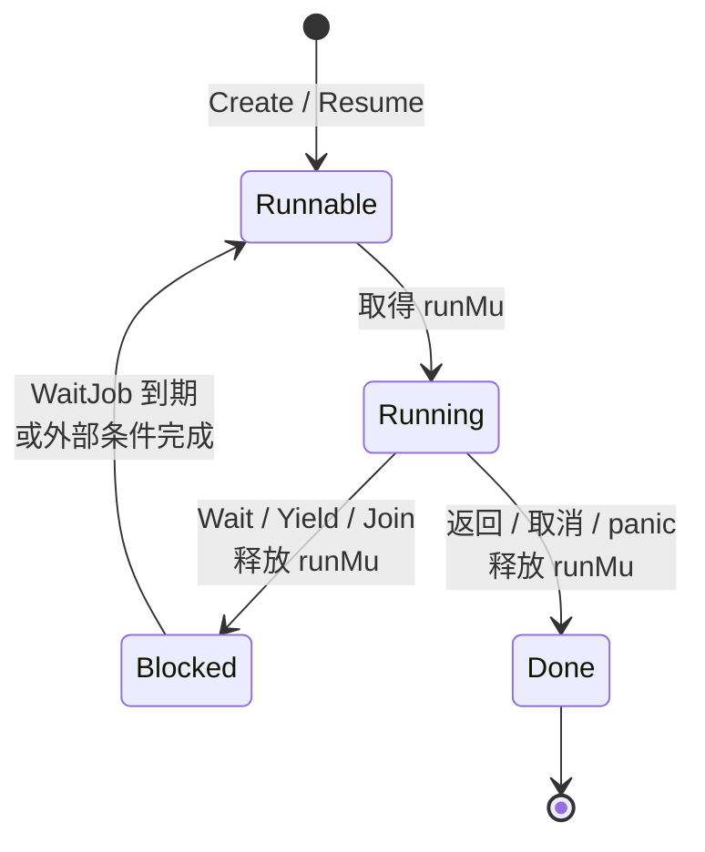
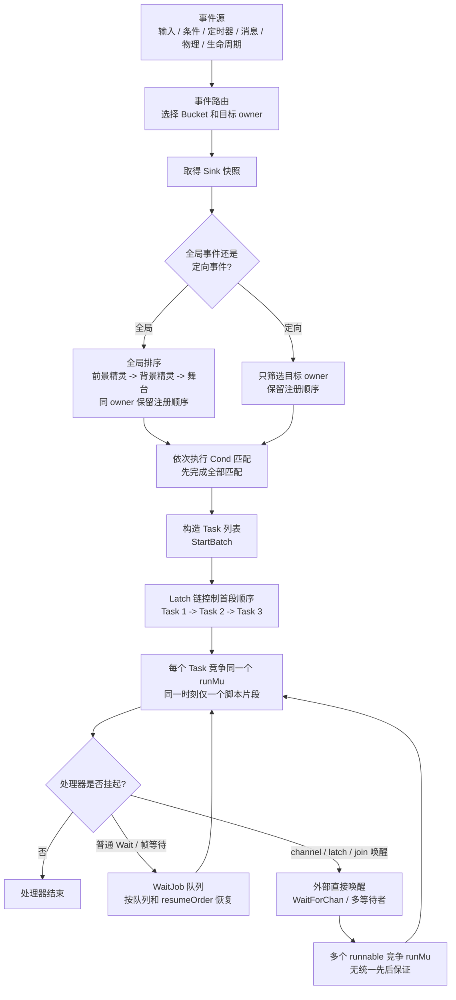
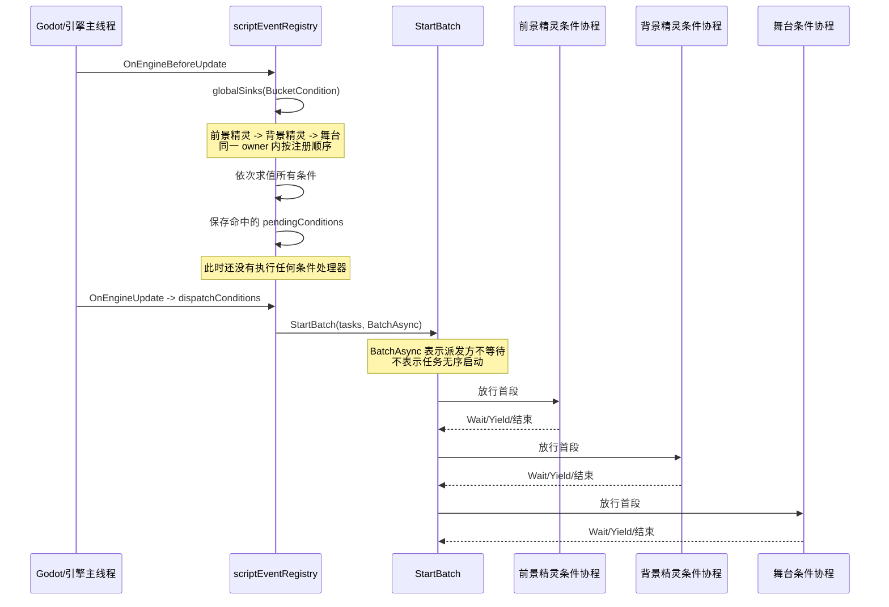
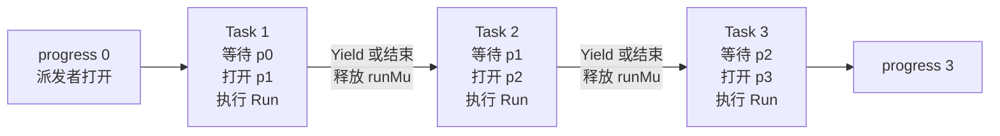
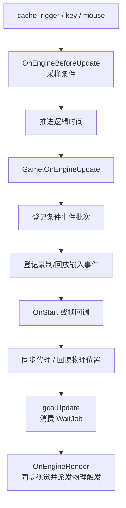
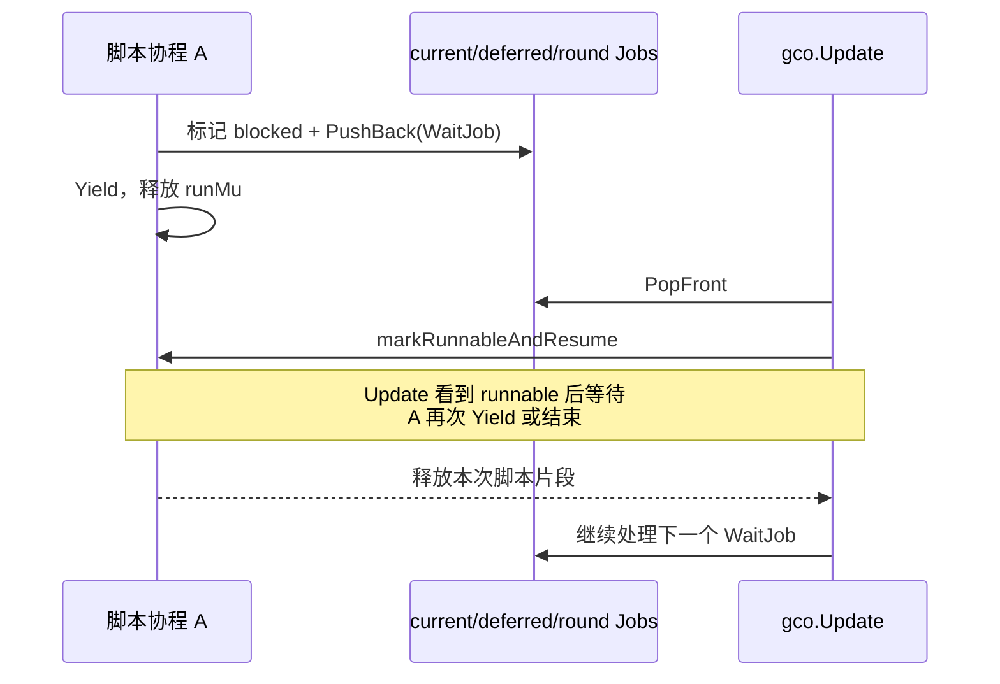

# SPX 事件协程的执行顺序与调度机制

本文回答四个容易混在一起的问题：

1. 事件源按什么顺序进入 Go；
2. 一次事件命中的多个处理器按什么顺序开始；
3. 处理器挂起后按什么顺序恢复；
4. 哪些场景没有顺序保证，只能由多个 goroutine 竞争执行权。

> 核心结论：SPX 脚本不是多个协程同时执行，也不是在任意代码位置随机抢占。
> `runMu` 保证同一时刻只有一个受管脚本片段执行。没有保证的是：当多个协程都已
> 具备运行资格时，谁先取得 `runMu`。只有经过批次 Latch 链或 `WaitJob` 队列的路径，
> 才有额外的确定性顺序。

---

## 1. 先定义“脚本执行片段”

一个受管协程取得 `runMu` 后，会连续执行到以下任一边界：

- 调用 `Wait`、`WaitNextFrame`、`Yield`、`Join` 等主动挂起；
- 正常返回；
- 被取消或发生 panic。

这段连续执行过程称为一个“脚本执行片段”，下文也简称“首段”或“后续片段”。



`runMu` 的效果是：

```text
协程 A 持有 runMu 执行脚本
    |
    | 即使 Go 运行时暂时切走 A
    v
协程 B 仍然拿不到 runMu，不能执行另一个 SPX 脚本片段
    |
    v
A 主动挂起或结束，释放 runMu
    |
    v
其他 runnable 协程才有机会取得脚本执行权
```

因此，“无顺序保证”不是指 A 执行到普通语句中间时 B 突然插入，而是指 A 释放
`runMu` 后，如果 B、C 都是 runnable，B 和 C 谁先得到锁未必确定。

相关代码：

- `internal/coroutine/lifecycle.go:118`：`runThread()` 取得 `runMu`；
- `internal/coroutine/scheduler.go:58`：`Yield()` 清除 current 并释放 `runMu`；
- `internal/coroutine/lifecycle.go:144`：协程结束时释放 `runMu`。

---

## 2. 总体机制图



这里有三层不同的顺序：

| 层次 | 解决的问题 | 是否有统一保证 |
| --- | --- | --- |
| 事件源/路由顺序 | 哪个事件先被发现、先调用派发函数 | 部分有，取决于事件来源 |
| 单次事件的批次顺序 | 同一次事件命中的处理器谁先执行首段 | 有，`StartBatch` 严格串联 |
| 挂起后的恢复顺序 | 多个旧协程谁先继续执行 | `WaitJob` 有稳定规则；直接唤醒没有 |

---

## 3. 以条件事件为例

### 3.1 完整时序



条件事件有两道确定性顺序：

1. **条件求值顺序**：`globalSinks()` 先按 Scratch 目标顺序排列，然后
   `matchingEventSinks()` 在一个普通 `for` 循环中依次求值。所有条件求值完成后，
   才会启动任一处理器。
2. **处理器首段顺序**：命中的 Sink 原样转换成 Task，`StartBatch()` 用 Latch 链
   保证前一个处理器挂起或结束后，后一个处理器才能真正执行。

正常情况下顺序是：

```text
check-front
check-back
check-stage
run-front 的首段
run-back 的首段
run-stage 的首段
```

同一个 owner 注册多个条件时，保留注册顺序。条件处理器还在执行时，`running` 会让
该处理器跳过后续条件求值，因此同一个 `OnCond` 不会重入。

### 3.2 首段有序不等于完成有序

假设前景精灵和背景精灵同时命中：

```text
前景处理器：A1 -> WaitNextFrame() -> A2
背景处理器：B1 -> 结束
```

能够保证：

```text
A1 -> B1
```

不能仅凭批次顺序断言 `A2` 在 `B1` 前面。A 在 `WaitNextFrame()` 处已经结束首段，
批次会继续让 B 执行；A2 属于后续恢复阶段，由等待队列决定。

相关代码：

- `runtime_conditions.go:27`：条件上升沿、`running` 防重入；
- `runtime_conditions.go:48`：条件采样；
- `runtime_conditions.go:63`：以 `BatchAsync` 派发命中处理器；
- `runtime_event_dispatch.go:172`：全局 Sink 的 Scratch 目标顺序；
- `runtime_event_dispatch.go:226`：依次匹配全部 Sink；
- `internal/coroutine/batch.go:38`：`StartBatch()`；
- `internal/coroutine/batch.go:61`：Latch 启动链。

---

## 4. `StartBatch` 如何保证首段顺序

假设一次事件命中三个处理器，`registerBatch()` 会创建四个 Latch：



每个 Task 的包装逻辑等价于：

```go
current.Wait()
next.Open()
run(thread)
```

Task 1 打开 `progress[1]` 时仍持有 `runMu`，所以 Task 2 虽然已经 runnable，也不能
执行用户代码。只有 Task 1 挂起或结束并释放 `runMu`，Task 2 才能进入自己的首段。

这里保证的是批次成员的**相对首段顺序**：Task 2 的首段不会早于 Task 1，Task 3
的首段不会早于 Task 2。Task 1 释放 `runMu` 后，如果此时还有批次外协程也已
runnable，它可能插在 Task 1 和 Task 2 之间；Latch 链没有建立全局调度队列。

三种批次模式只改变“派发者等到什么时候返回”，不改变批次内部首段顺序：

| 模式 | 派发者等待到 | 使用场景 |
| --- | --- | --- |
| `BatchAsync` | 完成整批登记后立即返回 | 条件、按键、点击、定时器、触碰等 |
| `BatchWaitFirstSlice` | 每个未取消任务都至少挂起一次或结束 | `OnStart`、`OnCloned` |
| `BatchWaitDone` | 全部任务彻底结束 | `OnAwake`、`BroadcastAndWait`、等待式背景切换 |

注意：`BatchWaitDone` 只保证调用者最后等到全部结束，不保证各处理器的**结束顺序**。
例如第一个处理器先 `Wait`，第二个处理器可以先结束。

---

## 5. 各类事件的顺序规则

### 5.1 同一次事件批次内部

| 事件 | 本批次的处理器排列 | 批次模式 | 重复触发策略 |
| --- | --- | --- | --- |
| `OnCond` | 前景精灵 -> 背景精灵 -> 舞台；同 owner 注册顺序 | Async | 运行中不再求值，不重入 |
| `OnStart` | 前景精灵 -> 背景精灵 -> 舞台；同 owner 注册顺序 | WaitFirstSlice | 生命周期只派发一次 |
| `OnAwake` | 全局排序后再按 owner 匹配 | WaitDone | 调用者等待全部完成 |
| `OnTimer` | 前景精灵 -> 背景精灵 -> 舞台；同 owner 注册顺序 | Async | 无 HandlerState，可出现重叠执行 |
| `OnKey` | 具体按键处理器在前，`AnyKey` 在后；各组内部按全局顺序 | Async | `IgnoreWhileRunning`，运行中忽略新触发 |
| `OnClick` | 被点击 owner 内的注册顺序 | Async | `RestartExisting`，新触发取消旧执行 |
| `OnSwipe` | 目标 owner 内的注册顺序 | Async | 无 HandlerState，可重叠 |
| `OnTouchStart` | 源精灵 owner 内的注册顺序 | Async | 无 HandlerState，可重叠 |
| `OnCloned` | 新克隆 owner 内的注册顺序 | WaitFirstSlice | 克隆流程等待首段初始化 |
| `Broadcast` / `IReceive` | 前景精灵 -> 背景精灵 -> 舞台；同 owner 注册顺序 | Async | `RestartExisting` |
| `BroadcastAndWait` | 与 Broadcast 相同 | WaitDone | `RestartExisting`，调用者等待全部结束 |
| 背景切换事件 | 前景精灵 -> 背景精灵 -> 舞台 | Async 或 WaitDone | `RestartExisting` |

上表中的“排列”都只直接保证本批次的首段执行顺序。如果处理器从不挂起，首段就是
整个函数，此时观察到的就是完整的顺序执行。

消息还有一条额外规则：递归 Broadcast 在同一帧、同一脚本轮次再次命中同一个接收者
时，该接收者会 `YieldToNextRoundFor()`，避免同一接收者无限递归重入。

### 5.2 事件来源自己的顺序

| 事件来源 | 有保证的部分 | 不保证的部分 |
| --- | --- | --- |
| `Game.events` | 已成功入队的元素按 channel FIFO；唯一 `eventLoop` 逐个 `handleEvent` | 并发发送者谁先入队没有额外规则；每个事件创建 Async 批次后也不等待处理器完成 |
| 键盘/鼠标实时输入 | `inputEventLoop` 按本轮采样顺序生成高层事件 | 处理器进入不同异步批次后，不能仅凭输入先后推断完成先后 |
| 物理触发 | `pending -> ready` 保留实际追加顺序，`processPhysicsTriggers` 依次遍历 | 并发回调的加锁先后没有业务顺序承诺；不同触发批次也没有全局执行屏障 |
| 条件事件 | 同一帧先完成全部条件采样，再派发该快照 | 与同帧其他异步事件批次之间没有共同的批次顺序 |
| 帧回调 | 按目标 frame 稳定排序；相同 frame 保留登记顺序；逐个等待首段 | 回调挂起后的完成顺序仍由各自等待条件决定 |
| Bootstrap/Main | `MainEntry`、各精灵 `Main` 按显式循环逐个运行到首次挂起 | 首次挂起后的恢复属于普通协程调度 |

---

## 6. 一帧内“调用顺序”不等于“协程完成顺序”

引擎一帧的主要调用顺序是固定的：



这里可以确定“条件批次先登记，输入会话批次后登记”。但是两个独立的
`BatchAsync` 之间没有一条共同的 Latch 链，所以不能把“登记先后”直接扩大成
“所有条件处理器一定先于所有输入处理器执行完”。

只有下列情况能建立跨操作的明确屏障：

- 使用 `BatchWaitFirstSlice`：等被调用批次全部完成首段；
- 使用 `BatchWaitDone` / `Join`：等目标全部结束；
- 父协程通过 `JoinYieldedOrDone`：等子协程首次挂起或结束；
- 所有工作被放进同一个 `StartBatch`：由同一条 Latch 链排序。

---

## 7. 挂起后的恢复顺序

### 7.1 有稳定顺序：`WaitJob` 队列

`Wait`、`WaitNextFrame`、循环 Yield 等会生成 `WaitJob`：



明确规则如下：

1. `currentJobs` 按队首依次处理；
2. `Update` 恢复一个协程后，会先等它再次挂起或结束，再处理普通的下一个任务；
3. 延期任务在帧尾按 `resumeOrder` 稳定排序；
4. `resumeOrder` 初始等于 Thread 创建 ID；
5. `RestartExisting` 创建的替代处理器会继承旧处理器的 `resumeOrder`，避免它在帧等待
   队列中的相对位置因重启漂移。

因此，通过普通 `WaitJob` 恢复的任务不是随机从一个 runnable 集合里挑选，而是队列化
发放恢复资格。在没有同时发生外部直接唤醒的常规路径中，这也形成实际执行顺序；若有
channel/worker 等直接唤醒路径同时介入，最终仍要竞争 `runMu`。相关实现位于
`internal/coroutine/update.go:122` 和
`internal/coroutine/update.go:199`。

### 7.2 没有统一顺序：直接唤醒

以下路径不经过 `WaitJob` 排序，而是直接调用 `markRunnableAndResume()`：

- 多个 `WaitForChan` / `WaitToDo` 的外部 worker 几乎同时完成；
- 一个 Latch 同时唤醒多个等待者；
- 一个协程结束时，同时唤醒多个 `Join` 或 `JoinYieldedOrDone` 等待者；
- `Sched()` 发起的直接恢复；
- 多次普通 `Create()` 创建协程，没有使用 `StartBatch` 串联。

这些协程都会先被标记为 runnable，然后竞争 `runMu`。谁先取得锁由 Go 调度和互斥锁
竞争决定，代码没有承诺 FIFO。

特别需要注意：`waiterSet` 内部使用 `map[Thread]struct{}`。关闭等待集合时遍历 map，
多个等待者的枚举顺序本身就是未定义的；即使逐个调用 `Resume()`，也没有锁获取顺序
保证。

---

## 8. 哪些有序，哪些无序

### 明确有序

- 一个处理器的单个脚本片段内部，普通语句按程序顺序执行；
- 同一次事件批次的处理器**首段**，按传给 `StartBatch` 的 Task 顺序执行；
- 全局事件的 Task 顺序通常是前景精灵、背景精灵、舞台，同 owner 内按注册顺序；
- `OnKey` 中具体按键处理器先于 `AnyKey` 处理器；
- 条件表达式全部按目标顺序求值完毕后，才开始执行任一条件处理器；
- `Game.events` 由单一 eventLoop 按 channel 接收顺序路由；
- 到期帧回调按 frame、登记顺序运行到首次挂起；
- `WaitJob` 由队列逐个恢复，延期任务按稳定 `resumeOrder` 排序。

### 没有统一顺序保证

- 两个独立 `BatchAsync` 批次之间，哪一批的协程先取得 `runMu`；
- 一个批次中各处理器挂起后的最终完成顺序；
- 多个普通 `Create()` 出来的 runnable 协程的首次锁竞争；
- 多个 channel/worker 同时完成后的直接恢复顺序；
- Latch、Join 等一次唤醒多个等待者后的执行顺序；
- 多个事件虽然按 FIFO 被路由，但各自异步处理器的完成顺序；
- 多个物理触发对各自创建的异步处理批次之间的用户代码完成顺序。

### 不是“随机抢占”的部分

- 正在执行的脚本不会因为另一个事件到来，就在任意普通语句中间让另一个 SPX 脚本
  插入执行；
- 切换通常发生在 `Wait`、`Yield`、`Join`、返回或取消等协作边界；
- `WaitMainThread` 等待 Godot 主线程结果时仍持有 `runMu`，因此其他脚本也不能插入
  这一业务操作的中间。

---

## 9. 阅读代码时的判断方法

遇到一个新的事件或调度入口，可以按下面顺序判断：

```text
1. 事件从哪里来？
   channel、pending/ready、当前调用栈，还是外部 worker？

2. Sink 如何排列？
   globalSinks、dispatchTarget，还是直接构造 tasks？

3. 是否进入同一个 StartBatch？
   是：本批次首段有序。
   否：继续找 Join、Latch 或其他显式依赖。

4. BatchMode 是什么？
   Async、WaitFirstSlice、WaitDone 只决定派发者等待程度。

5. 处理器是否会 Wait/Yield？
   会：首段之后必须重新分析恢复路径。

6. 恢复是否经过 WaitJob？
   是：查看队列和 resumeOrder。
   否：多个 runnable 通常没有先后承诺。
```

---

## 10. 关键源码索引

| 内容 | 文件和入口 |
| --- | --- |
| 条件注册、采样、派发 | `runtime_conditions.go`：`OnCond`、`sampleConditions`、`dispatchConditions` |
| 事件 Sink 排序与批量派发 | `runtime_event_dispatch.go`：`globalSinks`、`sinksInScratchTargetOrder`、`dispatchMatchedScriptEventBatch` |
| 各事件选择的 BatchMode | `runtime_events.go`：`doWhenStart` 至 `doWhenBackdropChanged` |
| 批次首段顺序 | `internal/coroutine/batch.go`：`StartBatch`、`registerBatch` |
| 唯一脚本执行权 | `internal/coroutine/lifecycle.go`：`runThread`、`finishThread` |
| Yield/Resume 握手 | `internal/coroutine/scheduler.go`：`Yield`、`Resume`、`markRunnableAndResume` |
| WaitJob 恢复和稳定排序 | `internal/coroutine/update.go`：`nextUpdateAction`、`processWaitJob`、`promoteDeferredJobs` |
| Handler 重入策略 | `internal/coroutine/handler.go`：`RestartExisting`、`IgnoreWhileRunning` |
| 多等待者集合 | `internal/coroutine/waiters.go`：`waiterSet` |
| 普通输入和高层事件循环 | `runtime_loops.go`、`internal/core/runtime/loop.go` |
| 一帧各阶段调用顺序 | `internal/engine/engine.go:onUpdate`、`runtime_engine.go` |
| 物理触发缓存和派发 | `internal/engine/trigger_event.go`、`runtime_sync.go:processPhysicsTriggers` |
