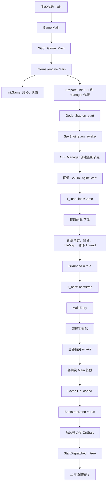

# SPX 游戏启动与初始化流程

本文梳理从生成代码的 `main()` 到项目进入正常逐帧运行的完整过程，重点回答：

- Godot 和 Go 分别何时初始化；
- Manager、资源、Go 业务对象和 Godot 节点分别何时创建；
- `MainEntry`、精灵 `Main`、`OnLoaded`、`OnStart` 的真实执行顺序；
- 启动任务和 Godot 主线程如何配合；
- 哪些资源在启动期读取，哪些资源仍是按需加载。

## 1. 先建立整体认识

启动不是一个函数从头同步执行到底，而是四层工作依次接力：

1. **Go 静态运行时初始化**：建立 `Game`、事件表、Shape Manager、同步缓冲和精灵类型表，不读取项目资源。
2. **Godot 桥接与 Manager 初始化**：注册跨语言回调，创建 C++ Manager 和 SPX 场景根节点。
3. **项目资源与对象构建**：读取配置和字体，创建 Go 精灵对象、Godot 精灵代理、背景、TileMap、相机及循环协程。
4. **脚本 bootstrap**：执行 `MainEntry`、碰撞初始化、精灵 `awake/Main`、`OnLoaded`，随后在帧更新中派发 `OnStart`。

最重要的边界是：

> “配置已经读取”“对象已经创建”“脚本已经注册事件”“OnStart 已经执行”是四个不同状态。

总体调用关系如下：



## 2. 阶段一：生成代码进入 SPX

以 [`test/Quote/xgo_autogen.go`](test/Quote/xgo_autogen.go) 为例，生成代码大致做三件事：

```go
func (this *Game) Main() {
    crocodile := &Crocodile{Game: this}
    this.Crocodile = crocodile

    monkey := &Monkey{Game: this}
    this.Monkey = monkey

    spx.XGot_Game_Main(this, crocodile, monkey)
}
```

此时：

- `Game`、`Crocodile`、`Monkey` 都已经有 Go 指针；
- 这些精灵还只是生成类型的零值对象；
- 没有读取 `assets/sprites/*/index.json`；
- 没有创建 `SpxSprite` 节点；
- 精灵 `Main()` 也没有执行。

入口 [`XGot_Game_Main`](game_run.go) 调用 [`internal/engine.Main`](internal/engine/engine.go)，并在它的 `initialize` 回调中执行 `Game.initGame`。

`initGame` 只初始化纯 Go 状态，主要包括：

- 初始化 `shapeManager`；
- 初始化脚本事件注册表；
- 初始化帧事件缓存和 `SpriteSyncBuffer`；
- 把生成精灵登记为 `精灵名 -> reflect.Type`；
- 保存生成的 `Gamer`，供后面反射字段和调用 `MainEntry/OnLoaded`。

精灵参数在这里的意义是**登记具体 Go 类型**，不是把它们加入舞台。

## 3. 阶段二：建立 Go 与 Godot 的连接

[`internal/engine.Main`](internal/engine/engine.go) 的工作顺序是：

1. 创建 `gameBinding`，初始阶段为 `gameStarting`；
2. 执行上述纯 Go `initialize`；
3. 用 `enginewrap.Init(WaitMainThread)` 安装主线程切换能力；
4. 构造 `CoreCallbackInfo`；
5. 调用 `gdengine.PrepareLink`；
6. 把游戏切到 `gameRunning`；
7. 进入 `LinkSession.Run`。

`PrepareLink` 建立三组关系：

- 安装 Native 或 Web 的 FFI 函数表；
- 把 Godot 生命周期、输入、碰撞、精灵和 UI 回调绑定到 Go；
- 创建 Go Manager 代理，并赋给 `gdx.SpriteMgr`、`gdx.ResMgr` 等全局接口。

这里要区分两类 Manager：

| 层次 | 例子 | 作用 |
| --- | --- | --- |
| Go Manager 代理 | `internal/gdengine/impl.spriteMgr` | 把 Go 调用转成 Native/Web ABI 调用 |
| C++ Manager | `SpxSpriteMgr`、`SpxUiMgr` | 持有和操作真正的 Godot 节点/资源 |

Go 侧 [`gdengine.onEngineStart`](internal/gdengine/callbacks.go) 也会遍历代理的 `OnStart`，但当前代理继承的 `baseMgr.OnStart` 是空实现。真正创建基础节点的是更早执行的 C++ Manager 生命周期。

## 4. 阶段三：Godot 建立 SPX 场景基础设施

Godot 主循环开始后调用 [`Spx::on_start`](godot_modules/spx/spx.cpp)：

1. 取得 `SceneTree` 和根 `Window`；
2. 创建 `SpxEngineNode`；
3. 把它挂到根 `Window`；
4. 把 `SceneTree` 和节点交给 `SpxEngine`；
5. 调用 [`SpxEngine::on_awake`](godot_modules/spx/spx_engine.cpp)。

`SpxEngine::on_awake` 严格按以下顺序执行：

```text
所有 C++ Manager.on_awake
    -> 所有 C++ Manager.on_start
    -> callbacks.func_on_engine_start
    -> Go gdengine.onEngineStart
    -> Go internal/engine.onStart
    -> Game.OnEngineStart
```

因此 Go 收到 `OnEngineStart` 时，Godot 侧的 Manager 基础设施已经可以使用。

主要节点骨架可以理解为：

```text
Window
├─ SpxCallbackProxy                  延迟 reset 等内部回调
└─ SpxEngineNode                     SPX 场景锚点
   ├─ dont_destroy_root              跨场景保留的精灵/预制节点
   ├─ sprite_root                    运行期业务精灵和背景代理
   ├─ SpxUiMgr (CanvasLayer)         UI、气泡、监视器等
   ├─ pure_sprite_root               轻量渲染精灵/静态节点
   ├─ SpxCamera2D                    项目未提供相机时创建
   ├─ input_proxy                    Godot 输入信号代理
   ├─ audio_root                     运行期 SpxAudio/播放器节点
   ├─ debug_root                     调试绘制节点
   └─ pen_root (SpxPenSurface)       共享画笔画布
      ├─ pen_render_target (SubViewport)
      │  └─ pen_canvas_drawer (SpxPenCanvas)
      └─ pen_canvas (Sprite2D)       显示 SubViewportTexture
```

音频、物理、资源等 Manager 不一定都用一个可见根节点；它们仍已经完成自身 `on_awake/on_start` 初始化。

## 5. 阶段四：`Game.OnEngineStart` 创建加载任务

[`Game.OnEngineStart`](runtime_engine.go) 用 `sync.Once` 保证同一局只启动一次，然后：

1. 重建本局碰撞边界缓存；
2. 取得当前 `bootstrapGeneration`；
3. 用 `engine.Go` 创建加载 Thread，以下称 `T_load`。

`engine.Go` 最终使用 `gco.Create`。Thread 创建后即可竞争调度器的 `runMu`，所以它可能在下一次 `gco.Update` 之前开始；不能把它理解成“固定到下一帧才启动”。

但是 `T_load` 中创建 Godot 节点或资源时会调用 `WaitMainThread`：

```text
T_load 中执行普通 Go 解析
    -> 遇到 Godot API
    -> 把主线程任务加入调度器
    -> T_load 阻塞等待结果
    -> Godot 主线程泵送该任务
    -> 返回结果并继续 T_load
```

这使 JSON/反射等 Go 工作不必全部压在原始 Godot 启动回调栈中，同时保证 Godot 场景操作仍发生在主线程。

`T_load` 首先把 `Gamer.MainEntry` 加入 bootstrap 队列，但**此时不执行**。随后调用 `loadGame("assets", generation)`。

## 6. `loadGame` 的六个初始化阶段

主入口位于 [`game_build.go`](game_build.go)。

### 6.1 打开统一资源视图

[`OpenBuilderResources`](internal/core/project/resources.go) 的流程是：

```text
ResourceDir("assets")
    -> 得到 spxfs.Dir
    -> 检查 index_pack.json
    -> 可选包装 packedConfigDir
    -> LoadBuilderProject
       -> 读取 index.json
       -> 归一化项目资源路径
       -> 扫描、校验 fonts
       -> 解析 run 配置
```

`packedConfigDir` 使两种工程对上层具有相同接口：

- 若 `index_pack.json` 内嵌了 project/sprite/sound/font 配置，优先读内嵌 JSON；
- 未内嵌的配置和图片、音频等文件仍回退到底层目录；
- `loadGame` 不需要为普通工程和打包工程维护两套流程。

成功后 `OpenedBuilderResources.FS` 保存到 `Game.fs`，不会立刻关闭，因为运行期播放声音、动态切地图等操作仍需要它。

### 6.2 建立路径根并应用字体

`engine.SetAssetDir(opened.AssetDir)` 建立逻辑路径到引擎资源路径的转换根。后续的 `engine.ToAssetPath` 才能把：

```text
shared-assets/monkey.png
```

转换成 Godot 可读取的资源路径。

字体是启动期主动处理的资源：

1. `LoadProjectFonts` 扫描 `fonts/<family>/index.json`；
2. 校验每个字体族和字体文件；
3. `ResolveRuntimeFontPlan` 生成默认字体、字体族和回退顺序；
4. `ResMgr.ApplyProjectFonts` 在 Godot 侧以一次事务应用。

字体必须早于 UI、气泡和 Monitor 创建，否则已经创建的 `Control` 可能继承旧主题字体。字体事务失败会终止启动，不会带着半应用状态继续。

### 6.3 应用运行配置和系统设置

`parseCommandLineFlags`、`applyRuntimeConfig` 和 `setupGameSystems` 处理：

- 标题、全屏、窗口宽高；
- 是否启用物理；
- 事件队列策略；
- 截图快捷键；
- 图层排序方式；
- 寻路网格尺寸；
- 音频衰减和最大距离；
- 像素/形状碰撞模式与采样精度；
- 自动碰撞层；
- 全局重力、摩擦和空气阻力。

这一步建立的是全局规则，还没有执行用户脚本。

### 6.4 初始化生成精灵对象

[`loadGameSprites`](game_build.go) 先执行 `startLoad`：

- 初始化 Go 音频 Manager 和播放对象跟踪表；
- 建立空的声音配置缓存；
- 初始化 `Game.inputMgr`；
- 创建 `Game.events` 通道；
- 保存项目 `FS`。

随后 `WalkFields` 反射生成的 `Gamer` 字段。对每个精灵字段：

1. 必要时按登记的 `reflect.Type` 分配具体对象；
2. 读取 `sprites/<name>/index.json`；
3. 把服装、动画、声音等相对路径归一化到项目资源根；
4. 调用 `loadSpriteConfig`；
5. 把该生成对象的 owner 字段重新绑定到当前 `Game`。

`loadSpriteConfig` 会清零并重新初始化同一个生成对象。`Game.sprs` 保存：

```text
精灵类型名 -> 项目主实例/克隆原型
```

它不是当前舞台所有活动精灵的列表。

### 6.5 `SpriteImpl.init` 创建 Go 状态和 Godot 代理

[`SpriteImpl.init`](sprite_core.go) 可分成四步：

1. 读取服装/动画元数据，并把精灵作为脚本事件 owner 绑定到事件注册表；
2. 设置名称、初始位置、方向、缩放和可见性；
3. 初始化 transform、animation、physics、pen、sound、bubble 等组件；
4. 调用 `initRuntimeProxy` 创建 Godot 代理。

注意“绑定事件 owner”不等于“已经注册用户事件”。`OnClick`、`OnMsg`、`OnStart` 等注册代码通常写在生成精灵的 `Main()` 中，要到 bootstrap 才执行。

代理创建链路如下：

```text
SpriteImpl.initRuntimeProxy
  -> rebuildRuntimeProxy
  -> engine.WaitMainThread
  -> ensureProxyInitialized
  -> engine.BridgeNewBareSprite
  -> CreateBareSpriteForType[engine.Sprite]
  -> SpriteMgr.CreateBareSprite
  -> Native/Web ABI
  -> C++ SpxSpriteMgr::_create_sprite
```

C++ 对普通裸精灵创建的节点树是：

```text
sprite_root
└─ SpxSprite                       位置/旋转/缩放、物理主体
   ├─ RenderRoot (Node2D)          视觉轴心/渲染偏移
   │  ├─ Anim2D (AnimatedSprite2D) 服装纹理和动画帧
   │  └─ VisibleNotifier2D         需要时补建
   ├─ Area2D                       触发/感应区域
   │  └─ Trigger2D (CollisionShape2D)
   └─ Collider2D (CollisionShape2D)
```

`SpxSpriteMgr` 给节点分配全局 ID、加入 `sprite_root`、连接运行信号，并保存到 C++ `id_objects`。ID 返回 Go 后，`createSpriteValue` 构造 `internal/engine.Sprite`，再保存到 `internal/engine.state.sprites`。

同一个精灵因此有三层对象和三类索引：

| 位置 | 保存内容 | 用途 |
| --- | --- | --- |
| `Game.shapeMgr.items` | `*SpriteImpl` 等业务 Shape | 游戏查询、Z 序、帧同步、销毁 |
| `internal/engine.state.sprites` | ID 到 Go Godot 代理 `ISpriter` | Godot 回调按 ID 找 Go 代理 |
| `SpxSpriteMgr.id_objects` | ID 到 C++ `SpxSprite*` | ABI 调用按 ID 找实际节点 |
| `Game.sprs` | 名称到生成精灵主实例/原型 | 舞台引用和克隆模板 |

代理建立后还会提交：

- 碰撞体和触发器形状、层、掩码；
- 重力缩放和物理模式；
- 初始可见性；
- 精灵名和类型名；
- 图形特效；
- 动画完成/循环回调；
- 当前服装纹理与渲染参数。

图片配置在 Go 中解析较早，但真正的纹理资源由服装同步路径交给 Godot `ResMgr/AnimatedSprite2D` 使用。

### 6.6 TileMap、舞台和长期循环

`gameTilemapMgr.init` 在精灵配置加载后处理默认地图：

- 旧 `.json` 格式：Go 解析并保存 `TscnMapData`；
- 新目录格式：校验 `<dir>/tilemap.json`，交给 `TilemapparserMgr`，并可读取 `decorator.json`；
- 真正铺设旧格式瓦片或补充装饰物，要到舞台的 `setupAudioAndTilemap`。

[`loadStage`](game_load.go) 随后执行：

1. 解析显示设置；
2. 根据 TileMap、Map 和背景确定世界/窗口尺寸；
3. 配置平台窗口和相机；
4. 创建 `Game` 自身的背景精灵代理，背景层为 `-1`；
5. 应用 TileMap，更新相机边界和画笔 SubViewport 尺寸；
6. 分配舞台声音 owner，若配置 BGM 则开始播放；
7. 按 `project.zorder` 加载普通精灵和特殊 Shape；
8. 把需要执行生命周期的精灵加入 bootstrap 列表。

舞台的渲染层约定为：

```text
背景代理:             -1
共享画笔画布:          0
普通业务精灵:          1 开始连续分配
UI:                   CanvasLayer 独立管理
```

`loadGame` 最后调用 `initEventLoop`，创建三个长期 Thread：

| Thread | 首次通常在哪里挂起 | 后续工作 |
| --- | --- | --- |
| `eventLoop` | `WaitForChan(Game.events)` | 串行路由高层输入、消息、计时器事件 |
| `inputEventLoop` | `WaitNextFrame` | 采样键鼠状态并生成高层事件 |
| `logicLoop` | `WaitNextFrame` | 音频/动画完成、计时器、条件和调试面板 |

创建 Thread 不代表循环已经跑完一轮；它们取得 `runMu` 后通常立即进入各自等待点。

## 7. 资源到底何时加载

不能把所有资源都概括成“启动时一次性加载”。实际策略如下：

| 资源 | 启动期行为 | 真正引擎资源创建/使用时机 |
| --- | --- | --- |
| 项目 `index.json` | 立即读取、反序列化 | 启动期 |
| 精灵 `index.json` | 每种生成精灵立即读取 | 启动期 |
| 字体配置和文件 | 扫描、校验并应用 | UI 创建前，由 `ResMgr` 事务应用 |
| 服装图片 | 路径和图集元数据先解析 | 当前服装同步到 `AnimatedSprite2D` 时 |
| 声音 `index.json` | 通常不预读 | 第一次按名称播放时读取并缓存 |
| 音频文件 | 通常不预载 | `AudioMgr` 第一次播放时加载流 |
| BGM | 项目配置立即可知 | `setupAudioAndTilemap` 主动触发播放 |
| TileMap JSON | 默认地图启动时解析 | 舞台 setup 时创建/铺设 Godot 节点 |
| 动态 TileMap | 不加载 | 调用 `LoadTilemap` 时替换 |
| UI `.tscn` | 普通精灵启动不需要 | 创建 Ask/Say/Quote/Monitor 等 UI 时实例化 |

配置路径有两条读取路径：

- 普通文件系统走 `spxfs.Dir.Open`；
- `res://`、导出包或引擎挂载资源可经 `ResMgr.ReadAllText/HasFile`。

因此“Go 读取 JSON”和“Godot ResourceLoader 加载纹理、音频、PackedScene”应分开理解。

## 8. 阶段五：bootstrap 执行脚本初始化

`loadGame` 返回后，`T_load` 调用 `markGameStarted`：

```text
IsRunned = true
BootstrapDone = false
StartDispatched = false
```

随后 [`startBootstrap`](runtime_engine.go) 用 `engine.Go` 创建独立的 `T_boot`，不让加载 Thread 自己继续承担脚本生命周期。

当前实现的 bootstrap 顺序是：

```text
1. Gamer.MainEntry 首段
2. setupCollisionData
3. 所有舞台精灵 awake
4. 按舞台初始化列表逐个执行精灵 Main 首段
5. Gamer.OnLoaded（若存在）
6. BootstrapDone = true
```

其中：

- `awake()` 只负责默认动画和 `IsAwakened`，它不是用户的 `OnStart`；
- `MainEntry` 和精灵 `Main` 的主要职责通常是注册 `OnStart/OnClick/OnMsg/...`；
- `runMainUntilYield` 为 Main 创建子 Thread；
- `T_boot` 通过 `JoinYieldedOrDone` 等到该 Main **第一次挂起或结束**；
- 前一个精灵 Main 完成首段后，才开始下一个精灵 Main；
- Main 若在 `Wait/PlayAndWait` 等位置挂起，其剩余部分以后继续由调度器恢复。

这保证进入 `OnStart` 前，各对象至少已经完成 Main 的事件注册和同步初始化首段。

`bootstrapGeneration` 用于隔离 reset/reload：旧任务发现代际不匹配就退出，不能继续写入新一局。

## 9. `OnStart` 不是 bootstrap 内立即调用

`T_boot` 完成后只设置 `BootstrapDone`。在后续 [`Game.OnEngineUpdate`](runtime_engine.go) 中：

```text
runFrameScripts
  -> BootstrapDone && !StartDispatched
  -> dispatchStartEventIfNeeded
  -> eventStart.handle
  -> 脚本事件注册表取得全部 Start sinks
  -> 启动 OnStart 处理 Thread 批次
```

`OnStart` 使用“等待每个处理器完成首段”的批次模式。只有全部 `OnStart` 处理器至少首次挂起或结束后，才标记：

```text
StartDispatched = true
```

下一帧开始才进入普通的 `engine.RunFrameCallbacks` 路径。条件事件也要等 `StartDispatched` 后才采样，避免初始化条件尚未建立就提前触发。

三个状态应这样读：

| 状态 | 含义 | 仍未保证的事情 |
| --- | --- | --- |
| `IsRunned` | 资源和舞台对象已构建 | bootstrap 可能还没结束 |
| `BootstrapDone` | MainEntry、awake、各 Main 首段、OnLoaded 已完成 | OnStart 可能还没派发 |
| `StartDispatched` | 全部 OnStart 至少完成首段 | 挂起的 OnStart 以后仍会继续 |

## 10. 以 `test/Quote` 走一遍

项目入口和配置分别见：

- [`test/Quote/xgo_autogen.go`](test/Quote/xgo_autogen.go)
- [`test/Quote/assets/index.json`](test/Quote/assets/index.json)
- `test/Quote/assets/sprites/Crocodile/index.json`
- `test/Quote/assets/sprites/Monkey/index.json`

具体流程是：

1. 生成 `Game.Main` 创建 `Crocodile` 和 `Monkey` 的 Go 对象并登记其类型。
2. Godot 建立 `SpxEngineNode`、Manager 根节点和回调桥。
3. `T_load` 读取项目 `index.json`，得到背景 `lake.jpg` 和 Z 序 `Monkey -> Crocodile`。
4. 反射 `Game` 字段并读取两个精灵的 `index.json`。
5. 两个 `SpriteImpl.init` 分别创建对应 `SpxSprite` 节点树和 Go 引擎代理。
6. 创建舞台背景代理，应用世界、相机、画笔、音频和 Z 序。
7. 将 `Monkey`、`Crocodile` 加入 `shapeMgr.items`，业务图层从 1 开始。
8. `T_boot` 执行空的 `Game.MainEntry` 首段。
9. 建立碰撞数据，依次 `awake` 舞台精灵。
10. 按舞台初始化顺序执行 `Monkey.Main`、`Crocodile.Main` 的首段。
11. 两个 `Main` 只注册 `OnStart/OnClick/OnKey/OnMsg`，注册时不会立即执行处理器。
12. bootstrap 完成后的更新帧派发 `OnStart`。
13. 轮到 `Monkey.OnStart` 执行时第一次播放 `clap`，此时才按名称读取声音配置并由 Godot 加载音频。
14. 后续点击 Monkey，输入循环生成点击事件，事件注册表启动处理 Thread，`Quote("m")` 再创建对应 UI 节点。

这里可以清楚看到：精灵 Go 对象和 Godot 节点在用户 `OnStart` 前就已存在，而声音和 Quote UI 可以到事件真正发生时才创建。

## 11. 第一帧与正常帧的连接

Godot 每帧经 C++ `SpxEngine::on_update` 先更新 C++ Manager，再回调 Go。Go [`internal/engine.onUpdate`](internal/engine/engine.go) 的关键顺序为：

```text
缓存 pending 输入/碰撞事件为 ready 快照
    -> Game.OnEngineBeforeUpdate
    -> 推进 SPX 逻辑时间
    -> Game.OnEngineUpdate
       -> 条件/输入会话登记
       -> OnStart 或普通帧脚本登记
       -> Go -> Godot 第一轮精灵同步
       -> Godot -> Go 物理位置回读
    -> gco.Update
       -> 恢复本帧可运行脚本 Thread
    -> Game.OnEngineRender
       -> 补交协程产生的视觉变化
       -> 派发已封存的触发事件
    -> 截图/帧结束
```

启动阶段创建的对象到这里才与普通事件、协程恢复和帧同步完整衔接。

## 12. 失败、重置与所有权

启动错误不会被静默忽略：

- 项目 JSON、精灵配置、字体、TileMap 解析失败会进入 `engine.Panic`；
- 字体事务失败时不会继续创建 UI/事件循环；
- `loadGame` 未成功完成时不会启动 bootstrap；
- reset 会递增 `bootstrapGeneration`，清空旧队列和三个生命周期标志；
- `shapeManager.reset` 会先清理 Godot 精灵代理，再复用 Go 切片容量。

对象所有权要按层理解：

- 生成的 `Game` 和 `SpriteImpl` 由 Go 游戏对象持有；
- Go `internal/engine.Sprite` 是 ID 代理，由运行时注册表索引；
- `SpxSprite` 等 Node 加入 SceneTree 后由 Godot 管理；
- C++ Manager 保存的是节点借用指针和 ID 索引；
- `Game.fs` 保持打开以支持惰性资源加载和 reload。当前默认 asset FS 的 `Close` 是空操作，
  且 `Game.reset` 不会显式关闭它，因此不要把 reset 理解成会重新打开整个资源目录。

## 13. 推荐源码阅读顺序

按下面顺序阅读，可以避免在业务对象、代理对象和节点对象之间来回跳：

1. [`game_run.go`](game_run.go)：生成项目进入 SPX。
2. [`internal/engine/engine.go`](internal/engine/engine.go)：绑定一局游戏和每帧总入口。
3. [`internal/gdengine/linker.go`](internal/gdengine/linker.go)：FFI、回调和 Manager 代理绑定。
4. [`godot_modules/spx/spx.cpp`](godot_modules/spx/spx.cpp)：Godot 主循环入口。
5. [`godot_modules/spx/spx_engine.cpp`](godot_modules/spx/spx_engine.cpp)：C++ Manager 生命周期。
6. [`runtime_engine.go`](runtime_engine.go)：加载 Thread、bootstrap 和生命周期状态。
7. [`game_build.go`](game_build.go)：项目资源加载总流程。
8. [`internal/core/project/resources.go`](internal/core/project/resources.go)：统一资源视图和 JSON。
9. [`game_load.go`](game_load.go)：舞台、世界、相机、Z 序和 bootstrap 登记。
10. [`sprite_core.go`](sprite_core.go)：`SpriteImpl` 初始化。
11. [`internal/engine/runtime_factory.go`](internal/engine/runtime_factory.go)：Go 代理创建和 ID 注册。
12. [`godot_modules/spx/spx_sprite_mgr.cpp`](godot_modules/spx/spx_sprite_mgr.cpp)：实际 `SpxSprite` 节点树创建。
13. [`runtime_sync.go`](runtime_sync.go)：启动对象如何进入逐帧同步。
14. [`runtime_loops.go`](runtime_loops.go)：事件、输入和逻辑长期循环。
