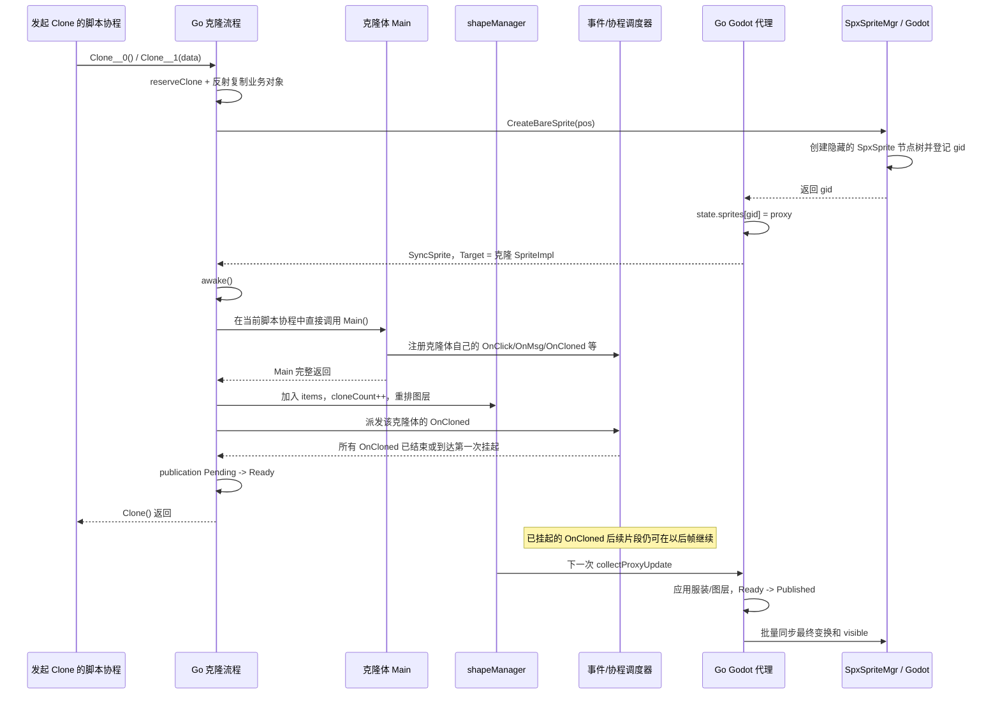
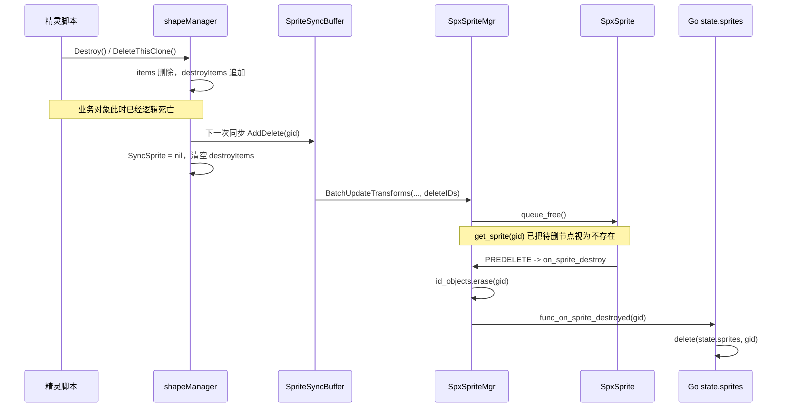

# 运行时精灵克隆、同步与销毁流程

本文只讨论游戏运行过程中由脚本调用 `Clone()` 创建的克隆体，以及调用
`Destroy()` / `DeleteThisClone()` 删除精灵的流程。项目启动时从配置加载普通精灵，
虽然复用了部分初始化函数，但生命周期屏障并不完全相同。

## 1. 先建立三个对象层次

一次运行时克隆并不是只创建一个对象，而是创建并关联三层对象：

| 层次 | 典型类型 | 主要职责 | 主要记录位置 |
|---|---|---|---|
| Go 业务对象 | 生成类型（如 `*Calf`），内部嵌入 `SpriteImpl` | 用户字段、组件状态、事件 owner、脚本生命周期 | `Game.shapeMgr.items` |
| Go Godot 代理 | `*internal/engine.Sprite` | 保存 Godot ID，把方法调用和 Godot 回调桥接到业务对象 | `internal/engine.state.sprites[id]` |
| Godot 节点 | `SpxSprite` 及其子节点 | 渲染、物理、碰撞、动画和场景树生命周期 | `SpxSpriteMgr.id_objects[id]` |

三者通过同一个 Godot `gid` 和代理的 `Target` 串联：

```text
生成精灵 *Calf
  └─ SpriteImpl.runtimeState.SyncSprite
       └─ *internal/engine.Sprite
            ├─ Id = gid
            └─ Target = *SpriteImpl

gid ──> internal/engine.state.sprites[gid] ──> Go 代理
gid ──> SpxSpriteMgr.id_objects[gid]        ──> Godot SpxSprite
```

需要特别区分：

- `Game.shapeMgr.items` 保存的是仍参与游戏逻辑的业务对象。
- `internal/engine.state.sprites` 保存的是可供 Godot 回调反查的低层 Go 代理。
- C++ `SpxSpriteMgr.id_objects` 保存的是 Godot 节点借用指针。
- `Game.sprs` 只保存“精灵名称 -> 项目原型/主实例”，运行时克隆不会写入这里。

因此，克隆不是向 `Game.sprs` 再增加一个同名对象；所有克隆都通过
`shapeMgr.items` 参与活动对象管理。

## 2. 克隆总流程

主要代码入口位于 [sprite_clone.go](sprite_clone.go)：

```text
脚本事件协程调用 Clone__0 / Clone__1
  -> CloneWith
  -> doClone
  -> createRuntimeClone
       1. reserveClone 预占克隆名额
       2. 按源精灵的实际 Go 类型反射创建新对象
       3. cloneSprite
            3.1 浅复制生成精灵结构体
            3.2 InitFrom 重建 SpriteImpl 私有状态
            3.3 cloneFrom 重建各组件
            3.4 创建隐藏的 Godot SpxSprite 和 Go 代理
            3.5 awake
            3.6 在当前协程中重新执行克隆体 Main
       4. 加入 Game.shapeMgr.items
  -> dispatchCloneLifecycle
       5. 派发克隆体自己的 OnCloned
       6. 等待 OnCloned 首个执行片段结束或挂起
       7. Pending -> Ready
  -> Clone() 返回
  -> 下一次代理批量收集
       8. 应用服装、图层、物理形状和最终变换
       9. Ready -> Published
      10. Godot 节点正式按逻辑可见性显示
```

对应时序如下：



## 3. 第一步：预占名额并创建同类型 Go 对象

`createRuntimeClone` 先调用 `shapeManager.reserveClone()`。克隆上限按下面的值判断：

```text
cloneCount + pendingClones < maxClones（300）
```

- `cloneCount`：已经进入 `shapeMgr.items` 的克隆数。
- `pendingClones`：正在初始化、尚未进入 `items` 的克隆数。

之所以需要 `pendingClones`，是因为克隆初始化期间的 `Main` 可以挂起，也可能递归
调用 `Clone()`。如果只统计已经加入 `items` 的对象，就可能在初始化阶段绕过上限。

随后代码通过反射按源对象的动态类型分配新对象。假设源对象是生成代码中的
`*Calf`，得到的也是新的 `*Calf`，而不只是一个裸 `*SpriteImpl`。因此 `id` 等用户
字段也能够被复制。

## 4. 第二步：复制哪些状态

### 4.1 生成结构体和 `SpriteImpl`

`cloneSprite` 先通过 `out.Set(in)` 浅复制整个生成精灵结构体，然后对支持
`InitFrom` 的内嵌字段重新初始化。

`SpriteImpl.InitFrom` 主要完成：

- 共享同一个 `scriptEventRegistry`，但把事件 owner 改为新克隆体。
- 复制名称、缩放、可见性和图形效果参数。
- 设置 `Cloned = true`，清除 `Dying`、`Awakened` 等生命周期状态。
- `original` 始终指向该克隆族的原始精灵；克隆的克隆也不会成为新的族根。
- 清空事件注册提示位和代理发布状态。
- 重置脏版本，确保新代理会收到完整状态。

浅复制会短暂复制源对象的 `SyncSprite` 指针，但
`rebuildRuntimeProxy` 会先把它置空，再为克隆创建全新的代理。源精灵和克隆体不会
共同控制同一个 Godot 节点。

### 4.2 组件

`spriteComponents.cloneFrom` 为克隆体创建独立组件：

| 组件 | 克隆行为 |
|---|---|
| `transform` | 复制位置、方向、旋转样式和 pivot，owner 改为克隆体 |
| `animation` | 共享只读动画资源，重新建立运行状态和回调 |
| `physics` | 复制模式、质量、阻力、碰撞/感应形状，重新建立目标集合 |
| `pen`、`sound` | 按原始实例的当前状态继承，但组件实例仍独立 |
| `bubble` | 不继承现有气泡，初始化为 `nil` |

所以“继承状态”不等于“共享可变组件对象”。克隆后修改位置、物理状态或动画状态，
不会直接修改源精灵的同一个组件实例。

## 5. 第三步：同步创建 Godot 节点

`cloneSprite` 在执行克隆体 `Main` 之前调用：

```text
SpriteImpl.initRuntimeProxy
  -> rebuildRuntimeProxy(true)
  -> engine.WaitMainThread
  -> ensureProxyInitialized
  -> engine.BridgeNewBareSprite
  -> internal/engine.CreateBareSpriteForType[Sprite]
  -> SpriteMgr.CreateBareSprite
  -> C++ SpxSpriteMgr::create_bare_sprite
```

这里会通过 `WaitMainThread` 切到 Godot 主线程，并等待创建任务完成。创建完成前，
克隆流程不会继续执行 `awake` 和 `Main`。

### 5.1 C++ 创建的节点树

业务 `Clone()` 使用的是 `create_bare_sprite`，不是 C++ 的 `clone_sprite`。C++ 会新建：

```text
sprite_root
└─ SpxSprite                         gid = 新 ID，初始位置 = 克隆位置
   ├─ RenderRoot (Node2D)
   │  └─ Anim2D (AnimatedSprite2D)
   ├─ Area2D
   │  └─ Trigger2D (CollisionShape2D)
   └─ Collider2D (CollisionShape2D)
```

随后 `_create_sprite` 依次执行：

1. 把 `SpxSprite` 加入 `sprite_root`。
2. 调用 `SpxSprite::on_start()` 解析和初始化子节点。
3. 写入 `SpxSpriteMgr.id_objects[gid]`。
4. 发出 `func_on_sprite_ready(gid)` 回调。
5. 把 `gid` 返回 Go。

C++ 的 `clone_sprite` 是另一个低层 API，会直接 `duplicate()` 已有 Godot 节点；根包
`SpriteImpl.Clone()` 的业务克隆路径没有使用它。业务层选择“Go 状态复制 + 新建裸节点”，
这样 Go 仍然是业务状态和事件生命周期的控制方。

### 5.2 Go 代理登记

Godot 返回 `gid` 后，`createSpriteValue` 创建 `*internal/engine.Sprite`，并通过
`InitSpriteInstance` 完成：

1. `proxy.Id = gid`。
2. `internal/engine.state.sprites[gid] = proxy`。
3. 执行低层代理的 `onCreate()` 和 `OnStart()`。
4. `BridgeNewBareSprite` 再设置 `proxy.Target = 克隆 SpriteImpl`。
5. `SpriteImpl.runtimeState.SyncSprite = proxy`。

这里的低层代理 `OnStart()` 不是用户脚本写的精灵 `OnStart` 事件。普通
`internal/engine.Sprite` 的该方法目前为空，真正的业务事件由 `scriptEventRegistry`
管理。

Native 直调路径还有一个顺序细节：C++ 的 `func_on_sprite_ready` 在 `gid` 返回之前触发，
此时新代理通常还没有写入 `state.sprites`；返回后执行的 `InitSpriteInstance` 才是这条
创建路径的正式代理初始化步骤。因此不能把业务克隆初始化理解为由
`onSpriteReady` 回调驱动。

### 5.3 为什么节点先隐藏

创建 Godot 节点之前，克隆会建立下面的发布状态机：

```text
Pending -> Ready -> Published
```

- `Pending`：代理已经创建，但 `Main` 和 `OnCloned` 首段初始化尚未完成。
- `Ready`：初始化屏障已通过，等待下一次批量代理收集。
- `Published`：服装、图层、形状和最终变换已提交，可以正常显示。

`ensureProxyInitialized` 用 `effectiveProxyVisibility()` 设置初始可见性。即使克隆继承了
`IsVisible = true`，只要仍是 `Pending` / `Ready`，Godot 节点默认就是隐藏的。这避免
屏幕短暂显示服装、位置或图层尚未初始化完成的克隆体。

## 6. `awake`、`Main`、`OnStart`、`OnCloned` 的准确时机

这是克隆流程中最容易混淆的部分。

| 生命周期 | 运行时克隆的行为 |
|---|---|
| `awake()` | Godot 代理创建后立即调用；尝试播放默认动画并设置 `IsAwakened = true` |
| 生成精灵 `Main()` | `awake` 后立即重跑；直接占用发起 `Clone()` 的当前 SPX 协程 |
| 用户 `OnStart` | `Main` 会尝试重新注册，但全局启动事件已经派发后，克隆的迟到注册会被忽略 |
| 用户 `OnCloned` | 克隆加入 `shapeMgr.items` 后立即派发，为处理器创建独立协程 |

### 6.1 克隆体 `Main` 何时完成

运行时克隆没有为 `Main` 新建子协程，而是直接调用：

```go
runMain(outPtr.Main)
```

因此：

- 如果发起 `Clone()` 的是事件协程，克隆体 `Main` 就在该协程的当前调用栈中执行。
- `Main` 中调用 `Wait` / `Yield` 时，挂起的是发起克隆的当前协程。
- 后续帧恢复后仍从克隆体 `Main` 内继续执行。
- 必须等 `Main` **完整返回**，`cloneSprite` 才返回，克隆体才加入
  `shapeMgr.items`，随后才派发 `OnCloned`。

这和项目启动时普通精灵的 `runMainUntilYield` 不同。启动流程会为普通精灵 `Main`
创建单独 Thread，只等它执行到第一次挂起或结束；运行时克隆的 `Main` 则必须在当前
克隆调用链中完整返回。

### 6.2 为什么要重新执行 `Main`

生成的 `Main` 主要不是“每帧主函数”，而是脚本注册入口。例如：

```go
func (this *Calf) Main() {
    this.OnClick(...)
    this.OnCloned__0(...)
    this.OnMsg__1("undo", ...)
}
```

克隆体是新的事件 owner。若不重跑 `Main`，共享事件注册表中只有原精灵的 Sink，
克隆体不会拥有自己的点击、消息和克隆生命周期处理器。

重跑前，代码会快照生成结构体中除 `SpriteImpl` 外的顶层用户字段，重跑后再恢复。
因此 `XGo_Init` 等初始化语句不会覆盖从源精灵继承的用户变量；但事件注册写入的是
外部 `scriptEventRegistry`，不会被字段恢复撤销。组件方法等外部副作用也不会因为
顶层字段恢复而自动回滚。

### 6.3 克隆体不会重新执行全局 `OnStart`

项目启动事件只派发一次。`OnStart` 快照生成后，`TryAddStart` 不再接受新 Sink；如果
迟到注册来自运行时克隆，代码会静默忽略。

因此克隆专属出生逻辑必须写在 `OnCloned`，不能依赖重新执行 `OnStart`。

### 6.4 `OnCloned` 等待到什么程度

`dispatchCloneLifecycle` 直接快照 `BucketCloned` 中 owner 为新克隆体的处理器，并使用：

```text
gco.StartBatch(tasks, BatchWaitFirstSlice)
```

调用方会等每个 `OnCloned` 处理器满足以下任一条件：

- 处理器已经执行结束。
- 处理器执行到第一次 `Wait` / `Yield`，把脚本执行权交回调度器。

之后克隆从 `Pending` 变为 `Ready`，`Clone()` 可以返回。已经挂起的 `OnCloned`
协程并没有结束，后面的代码仍会在未来帧继续执行。

例如 `test/All/SpEffect` 中：

```go
this.OnCloned__0(func() {
    this.SetXpos(...)
    this.Say__0(...)
    this.Wait(3)
    this.DeleteThisClone()
})
```

首次发布前会完成 `SetXpos`、`Say`，然后在 `Wait(3)` 处建立首段屏障；三秒后协程
继续执行并删除克隆体。

## 7. 什么时候加入全局记录

下面按真实发生顺序列出主要记录的修改时机：

| 顺序 | 记录 | 修改内容 |
|---:|---|---|
| 1 | `shapeMgr.pendingClones` | `reserveClone()` 后加一，整个创建函数退出时减一 |
| 2 | C++ `SpxSpriteMgr.id_objects` | Godot 节点创建后登记 `gid -> SpxSprite*` |
| 3 | Go `internal/engine.state.sprites` | Godot 返回 `gid` 后登记 `gid -> ISpriter` 代理 |
| 4 | 克隆体 `scriptEventRegistry` Sink | 重跑克隆体 `Main` 时，以新 `SpriteImpl` 为 owner 登记 |
| 5 | `Game.shapeMgr.items` | `Main` 完整返回后加入活动业务对象列表 |
| 6 | `shapeMgr.cloneCount` | 与加入 `items` 同时加一 |
| 7 | 发布状态 | `OnCloned` 首段后 `Pending -> Ready`，代理收集时再 `Ready -> Published` |

`shapeMgr.addClonedShape` 还会按克隆层序规则把对象插入源对象附近，并重新计算全部
业务精灵图层。因为插入发生在 `OnCloned` 之前，所以 `OnCloned` 中查询、移动或删除
自身时，克隆已经是一个正式活动业务对象。

### 创建期间的阶段状态

| 阶段 | `shapeMgr.items` | `state.sprites` | C++ `id_objects` | Godot 可见 |
|---|---|---|---|---|
| 刚分配 Go 业务对象 | 无 | 无 | 无 | 无节点 |
| Godot/Go 代理创建完成 | 无 | 有 | 有 | 隐藏 |
| 克隆 `Main` 完整返回并加入活动列表 | 有 | 有 | 有 | 隐藏 |
| `OnCloned` 首段完成 | 有 | 有 | 有 | 仍隐藏，状态为 `Ready` |
| 下一次代理收集发布后 | 有 | 有 | 有 | 按业务 `IsVisible` 显示 |

注意：克隆体的 Godot 节点可能在 `Main` 长时间等待时已经存在，但它尚未进入
`shapeMgr.items`，并且受发布门控保持隐藏。

## 8. 克隆状态何时真正显示到 Godot

`finishCloneInitialization` 只把状态从 `Pending` 改为 `Ready`，不会立即调用
`SetVisible(true)`。真正发布发生在下一次 `collectProxyUpdate`：

1. 应用最终服装和图层。
2. 根据服装更新自动碰撞/感应形状。
3. 原子地把 `Ready` 改为 `Published`。
4. 强制标记代理脏，确保新的可见性不会被版本去重跳过。
5. 把位置、旋转、缩放、`RenderRoot` 偏移和可见性写入 `SpriteSyncBuffer`。
6. 通过一次批量 FFI 调用发送到 C++。

代理收集有两个帧内入口：

- `Game.OnEngineUpdate -> updateSpriteProxies`
- `Game.OnEngineRender -> syncPostCoroutineVisuals`

如果克隆发生在本帧 `gco.Update()` 中，通常会在紧随其后的 `OnEngineRender` 阶段
发布；其他调用时机也可能由下一轮 `OnEngineUpdate` 收集。准确规则不是“固定下一帧”，
而是“初始化变为 `Ready` 后的下一次代理收集”。

## 9. 删除入口

### 9.1 `Destroy()`

`SpriteImpl.Destroy()` 可以删除原精灵或克隆体，主要执行：

```text
Destroy
  -> destroy（幂等）
       1. 停止全部气泡
       2. 逻辑可见性设为 false
       3. 删除该 owner 的全部事件 Sink
       4. 销毁动画、物理、画笔、声音、气泡等组件状态
       5. 从 shapeMgr.items 立即移除
       6. 加入 shapeMgr.destroyItems 延迟删除队列
       7. 从 inputMgr 点击目标中移除
       8. 标记 hasDestroyed
  -> Stop(ThisSprite)，请求停止该精灵的全部脚本 Thread
  -> 如果当前正是该精灵脚本，则停止当前 Thread
```

`destroy()` 有已销毁检查，所以重复调用不会重复加入删除队列。

### 9.2 `DeleteThisClone()`

`DeleteThisClone()` 先检查 `Cloned`：

- 当前对象是克隆体：调用 `Destroy()`。
- 当前对象是原精灵：直接返回，不删除。

因此它适合在同一份脚本同时服务原精灵和克隆体时使用。

### 9.3 `Die()`

`Die()` 会先设置 `IsDying`、停止其他脚本、等待死亡动画，再调用 `Destroy()`。最终
销毁链路仍然和上面一致。

## 10. Go 侧逻辑删除为什么先发生

`shapeManager.removeShape` 会立即：

1. 从 `items` 删除业务对象。
2. 若为克隆体，`cloneCount--`，克隆名额立即释放。
3. 追加到 `destroyItems`。
4. 重算剩余精灵图层。

此后普通活动对象扫描、物理位置回读和渲染更新都不会再选择这个对象。同时：

- `clearHandlers()` 已删除所有事件 Sink。
- `inputMgr.removeClickTarget()` 已删除点击目标。
- 逻辑可见性已经是 `false`，迟到的触发事件也会被过滤。
- 已登记脚本 Thread 会被取消。

所以从游戏逻辑角度看，`destroy()` 内部清理完成时对象已经死亡；如果调用发生在该
精灵自己的脚本 Thread 中，随后的 `stopIfCurrentCoroutine` 会直接终止当前 Thread，
外层用户代码不会继续看到一次普通的 `Destroy()` 返回。Godot 延迟释放节点只是场景树
资源回收阶段，不代表该对象还能继续参与游戏。

## 11. 删除如何同步到 Godot

完整链路如下：

```text
Go SpriteImpl.Destroy()
  -> 从 shapeMgr.items 移除
  -> 放入 shapeMgr.destroyItems

下一次 flushSpriteProxyChanges
  -> shapeManager.flushDestroy
       -> syncBuffer.AddDelete(gid)
       -> SpriteImpl.runtimeState.SyncSprite = nil
       -> 清空 destroyItems
  -> SpriteSyncBuffer.Serialize
       [updateCount, deleteCount, updates..., deleteIDs...]
  -> SpriteMgr.BatchUpdateTransforms

C++ SpxSpriteMgr::batch_update_transforms
  -> 先完整校验数据包
  -> 先处理全部 delete ID
  -> SpxSpriteMgr::destroy_sprite
       -> block_signals
       -> queue_free()

Godot 安全删除阶段
  -> SpxSprite::_notification(NOTIFICATION_PREDELETE)
  -> SpxSprite::on_destroy_call
  -> SpxSpriteMgr::on_sprite_destroy
       -> 清除碰撞 pair 缓存
       -> id_objects.erase(gid)
       -> func_on_sprite_destroyed(gid)

Go 回调
  -> internal/gdengine.onSpriteDestroyed
  -> engine.DeleteSprite(gid)
  -> delete(internal/engine.state.sprites, gid)
```

对应时序：



删除命令在哪次同步发送，取决于 `Destroy()` 的发生时机：

- 在 `OnEngineUpdate` 收集前发生：可由该阶段发送。
- 在 `gco.Update` 的用户脚本中发生：通常由同帧 `OnEngineRender` 的补同步发送。
- 在本帧两次收集后发生：由下一帧发送。

## 12. 为什么 C++ 使用 `queue_free()` 而不是立即删除

Godot 节点可能正在场景树遍历、物理处理或信号派发中。`queue_free()` 把实际释放推迟
到 Godot 认可的安全阶段。

调用 `queue_free()` 后有一个短暂窗口：

- `id_objects` 中的条目尚未等到 `PREDELETE` 清除。
- 但 `get_sprite(gid)` 会检查 `is_queued_for_deletion()`，立即把它当作不存在。
- 因此同帧后续更新不会再作用到待删节点。

批处理还采用“删除优先”：同一个数据包先处理所有 delete ID，再处理更新记录。即使
异常情况下同一个 ID 同时出现在更新和删除中，删除也获胜。

## 13. 删除期间各份记录何时消失

| 阶段 | `shapeMgr.items` | `destroyItems` | `SpriteImpl.SyncSprite` | Go `state.sprites` | C++ `id_objects` / 节点 |
|---|---|---|---|---|---|
| 正常活动 | 有 | 无 | 有 | 有 | 有 |
| `destroy()` 逻辑清理完成 | 已删除 | 有 | 有 | 有 | 有 |
| `flushDestroy` 后 | 无 | 已清空 | `nil` | 有 | 有 |
| C++ `queue_free()` 后 | 无 | 无 | `nil` | 有 | 条目暂存，但节点已排队删除且不可查 |
| `PREDELETE` 回调后 | 无 | 无 | `nil` | 已删除 | 条目删除，节点释放 |

Go 业务对象也不一定在逻辑删除完成时立刻被垃圾回收。C++ `PREDELETE` 之前，
`state.sprites[gid]` 中的 Go 代理仍通过 `Target` 引用业务对象。等回调删除这份映射，
并且相关协程、闭包和用户变量都不再引用它后，Go GC 才能最终回收对象。

## 14. 在 `OnCloned` 中立即删除会发生什么

克隆在派发 `OnCloned` 之前已经加入 `shapeMgr.items`，所以处理器可以立即调用
`Destroy()` / `DeleteThisClone()`：

1. 克隆从活动列表移除并进入 `destroyItems`。
2. `OnCloned` Thread 被停止，首段屏障按任务结束处理。
3. `dispatchCloneLifecycle` 的 `defer` 仍会调用 `finishCloneInitialization`。
4. 该函数发现对象已经销毁，不执行 `Pending -> Ready`。
5. Godot 代理从未正式公开，随后按正常删除批次 `queue_free()`。

因此这种用法不会先显示一帧半初始化的克隆再删除。

## 15. 用 `tutorial/03-Clone` 对照理解

生成代码见 [tutorial/03-Clone/xgo_autogen.go](tutorial/03-Clone/xgo_autogen.go)。

`Calf.Main` 注册了三类事件：

```text
OnClick  -> Clone__0()
OnCloned -> gid++，记录克隆 id，前进 50 步，显示气泡
OnMsg    -> 收到 undo 时，最后一个克隆调用 Destroy()
```

点击原 `Calf` 后：

1. 原精灵的 `OnClick` 协程调用 `Clone__0()`。
2. 创建新的 `*Calf`、独立 Go 代理和隐藏 `SpxSprite`。
3. 新 `Calf.Main()` 重新执行，给新对象注册自己的三个事件 Sink。
4. `Main` 返回后，新对象加入 `shapeMgr.items`。
5. 派发新对象自己的 `OnCloned`，完成变量更新、移动和气泡创建。
6. `Say__1(this.id, 0.5)` 内部会等待 0.5 秒；处理器在这里第一次挂起后，克隆即可
   变为 `Ready`，而 `OnCloned` 的剩余部分稍后继续执行并收起气泡。
7. 下一次代理收集把首次挂起前得到的最终位置、服装和可见性提交给 Godot。
8. 点击 Arrow 广播 `undo` 后，各对象的 `OnMsg` 按注册和调度规则执行；命中的克隆
   调用 `Destroy()`，先从 Go 活动列表消失，再通过删除批次释放 Godot 节点。

## 16. 代码定位索引

| 流程阶段 | 主要文件 | 关键函数/类型 |
|---|---|---|
| 业务克隆总入口 | [sprite_clone.go](sprite_clone.go) | `CloneWith`、`doClone`、`createRuntimeClone`、`cloneSprite` |
| 业务精灵状态复制/删除 | [sprite_core.go](sprite_core.go) | `SpriteImpl.InitFrom`、`Destroy`、`DeleteThisClone`、`destroy` |
| 活动对象和延迟删除队列 | [shape_manager.go](shape_manager.go) | `reserveClone`、`addClonedShape`、`removeShape`、`flushDestroy` |
| 克隆事件注册与派发 | [sprite_events.go](sprite_events.go)、[runtime_events.go](runtime_events.go) | `OnCloned__1`、`doWhenCloned`、`clearHandlers` |
| 批次首段屏障 | [internal/coroutine/batch.go](internal/coroutine/batch.go) | `StartBatch`、`BatchWaitFirstSlice` |
| 发布门控和帧同步 | [runtime_sync.go](runtime_sync.go) | `beginCloneProxyPublication`、`finishCloneInitialization`、`collectProxyUpdate` |
| Go 代理创建 | [internal/engine/backend_adapter.go](internal/engine/backend_adapter.go)、[internal/engine/runtime_factory.go](internal/engine/runtime_factory.go) | `BridgeNewBareSprite`、`createBareSprite`、`createSpriteValue` |
| Go 代理全局表 | [internal/engine/runtime_registry.go](internal/engine/runtime_registry.go)、[internal/engine/runtime_bridge.go](internal/engine/runtime_bridge.go) | `state.sprites`、`DeleteSprite` |
| 代理初始化协议 | [pkg/spx/pkg/engine/framework.go](pkg/spx/pkg/engine/framework.go) | `InitSpriteInstance` |
| 同步缓冲编码 | [internal/engine/sprite_sync.go](internal/engine/sprite_sync.go) | `SpriteSyncBuffer.AddDelete`、`Serialize` |
| C++ 节点创建/排队删除 | [godot_modules/spx/spx_sprite_mgr.cpp](godot_modules/spx/spx_sprite_mgr.cpp) | `_create_sprite`、`create_bare_sprite`、`destroy_sprite` |
| C++ 批量删除优先级 | [godot_modules/spx/spx_sprite_batch.cpp](godot_modules/spx/spx_sprite_batch.cpp) | `batch_update_transforms` |
| Godot `PREDELETE` 回调 | [godot_modules/spx/spx_sprite.cpp](godot_modules/spx/spx_sprite.cpp) | `_notification`、`on_destroy_call` |
| C++ 回调清理 Go 映射 | [internal/gdengine/callbacks.go](internal/gdengine/callbacks.go) | `onSpriteDestroyed` |
| 实际克隆示例 | [tutorial/03-Clone/xgo_autogen.go](tutorial/03-Clone/xgo_autogen.go) | `Calf.Main` |

## 17. 最终结论

可以把运行时克隆理解为以下两段式提交：

```text
构造阶段：
复制 Go 状态 -> 创建隐藏 Godot 代理 -> awake -> Main 完整返回
-> 加入活动列表 -> OnCloned 首段完成

发布阶段：
下一次代理收集 -> 提交最终服装/形状/变换 -> 正式显示
```

删除则是相反的两段式流程：

```text
逻辑删除：
立即移出活动列表 -> 删除事件 -> 停止脚本 -> 加入 destroyItems

物理删除：
下一次批量同步发送 gid -> C++ queue_free
-> Godot PREDELETE -> 清除 C++ 和 Go 的 gid 注册表
```

这种设计让 Go 业务生命周期可以立即生效，同时遵守 Godot 节点必须在主线程创建、
并在场景树安全阶段延迟释放的规则。
